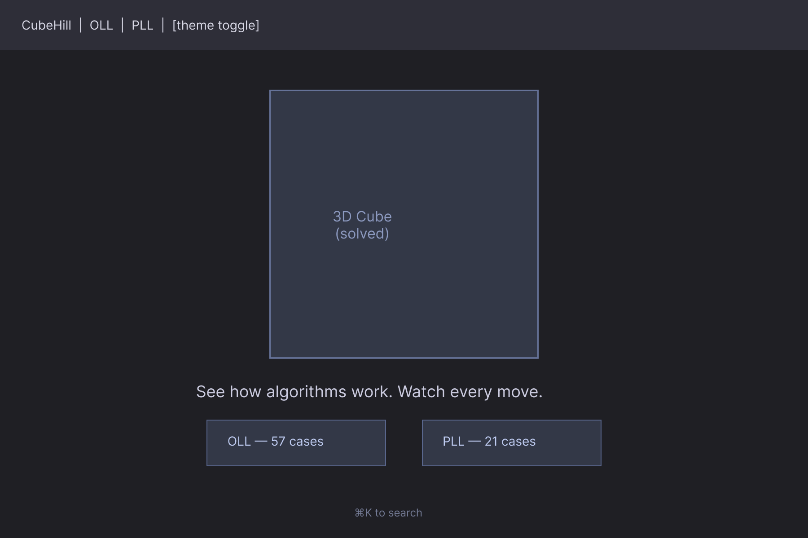
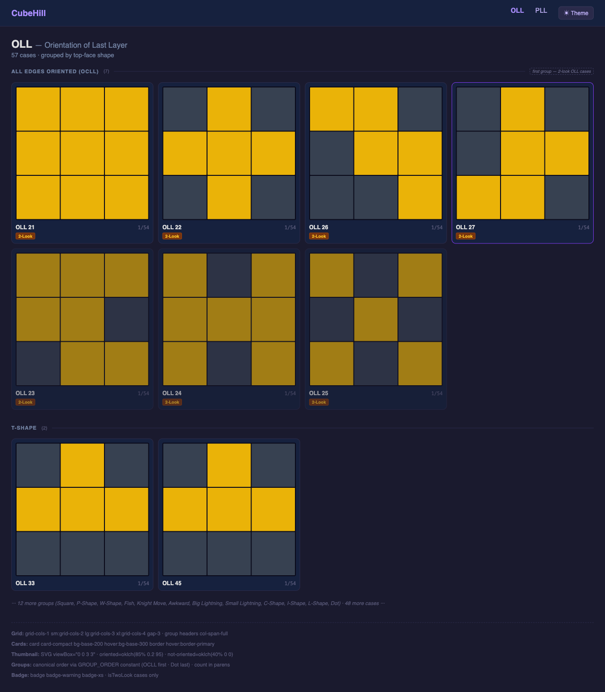
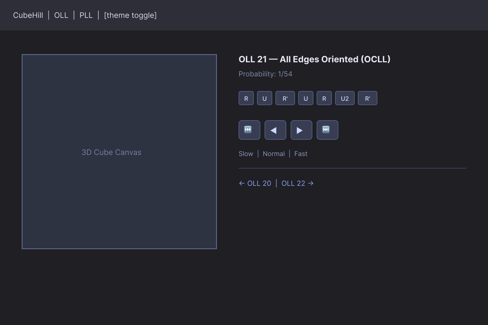

# Phase 5: Algorithm Data & Browse UI — Design Spec

Design spec for the three core browse UI surfaces: `AlgorithmCard` + `AlgorithmList`, the Algorithm Detail Page, and the Home Page. This document is the implementation blueprint for Phase 5. It builds directly on the Phase 4 CubeViewer and PlaybackControls components already specced.

**Input**: PM Product Brief at `designs/phase5-product-brief.md`. This spec reflects all requirements in that brief.

## Design Artifacts

**Figma file**: Design (`fiCCEbCrIIZqYVIm9XTjiD`), page: **Phase 5 — Browse UI**

### Figma Frames

| Frame | Node ID | Figma Link |
|-------|---------|------------|
| Home Page | `25:553` | [Open in Figma](https://www.figma.com/design/fiCCEbCrIIZqYVIm9XTjiD?node-id=25-553) |
| OLL Listing | `25:564` | [Open in Figma](https://www.figma.com/design/fiCCEbCrIIZqYVIm9XTjiD?node-id=25-564) |
| Algorithm Detail | `25:591` | [Open in Figma](https://www.figma.com/design/fiCCEbCrIIZqYVIm9XTjiD?node-id=25-591) |

**Wireframe screenshots** (exported from Figma):

### Home Page Wireframe



### OLL Listing Wireframe



### Algorithm Detail Page Wireframe



**Related design docs**:
- `designs/phase5-product-brief.md` — PM input document (read this before implementing)
- `designs/phase4-svelte-integration.md` — CubeViewer + PlaybackControls spec (already implemented)
- `designs/phase4-wireframes.md` — Phase 4 Figma frames and node IDs
- `designs/phase3-rendering-parameters.md` — 3D cube visual parameters

---

## Design Principles

1. **The cube is the hero.** On every surface — home, listing, detail — the 3D cube is the most prominent element. Cards, lists, and detail pages serve the goal of getting users to a cube they can interact with.
2. **Beginners and power users coexist.** The "2-Look" badge and group ordering serve beginners. The command palette (Cmd+K) and prev/next keyboard shortcuts serve experienced cubers. Neither experience degrades the other.
3. **Cards are for recognition, not learning.** The card shows enough to identify the case. Learning happens on the detail page. This keeps the grid scannable.

---

## 1. AlgorithmCard + AlgorithmList (cubehill-3j2.11)

### 1.1 AlgorithmCard

Each card is a clickable link to the case's detail page.

#### Card Anatomy (top to bottom)

```
┌─────────────────────────────┐
│                             │
│     [ Pattern Thumbnail ]   │
│     (square, fills width)   │
│                             │
│  OLL 21          1/54       │  ← name (bold) + probability (muted mono)
│  [2-Look]                   │  ← badge, only on isTwoLook cases
└─────────────────────────────┘
```

The thumbnail fills approximately 60% of the card height. The name row and optional badge fill the remaining 40%.

The group label is **not** repeated on the card — it appears in the group header above. Each card is compact: name, probability, and badge only.

#### DaisyUI Implementation

```html
<a href={resolve(`/${case.category}/${case.id}/`)}
   class="card card-compact bg-base-200 hover:bg-base-300
          border border-base-300 hover:border-primary
          transition-colors duration-150 cursor-pointer
          focus-visible:outline-2 focus-visible:outline-primary">
  <figure class="px-3 pt-3">
    <PatternThumbnail
      pattern={case.pattern}
      category={case.category}
      class="w-full aspect-square rounded-md" />
  </figure>
  <div class="card-body p-3 pt-2 gap-1">
    <div class="flex items-baseline justify-between gap-1">
      <h3 class="font-semibold text-sm leading-tight truncate">{case.name}</h3>
      <span class="text-xs font-mono text-base-content/50 shrink-0">{case.probability}</span>
    </div>
    {#if case.isTwoLook}
      <span class="badge badge-warning badge-xs self-start">2-Look</span>
    {/if}
  </div>
</a>
```

Key decisions:
- `case.name` and `case.probability` are on the same line (name left, probability right) to minimize card height
- `badge-warning` for "2-Look" — yellow/amber is the natural choice given the OLL orientation context (yellow stickers), and it stands out from primary-colored UI elements without looking like an error
- `resolve()` from `$app/paths` for all hrefs (required for GitHub Pages subpath deployment — the Architect's `components.md` confirms this pattern)

#### Pattern Thumbnail: OLL

The OLL thumbnail renders the 9-element `boolean[]` pattern as a 3×3 grid. The Architect's `components.md` specifies the SVG approach: `viewBox="0 0 3 3"` with 1 unit per cell — the simplest possible geometry.

```svg
<!-- viewBox="0 0 3 3", 48×48px display size (scales with CSS) -->
<!-- 9 <rect> elements, one per pattern cell -->
<!-- Each rect: x=col, y=row, width=0.95, height=0.95 (0.05 gap) -->

{#each pattern as oriented, i}
  {@const col = i % 3}
  {@const row = Math.floor(i / 3)}
  <rect
    x={col + 0.025}
    y={row + 0.025}
    width="0.95"
    height="0.95"
    fill={oriented ? '#f5c518' : '#555'}
  />
{/each}
```

The Architect specifies fixed color values: `oklch(85% 0.2 95)` for oriented (yellow) and `oklch(40% 0 0)` for not-oriented (grey). These render correctly in both dark and light themes — the yellow is vivid enough to read on any background, and the grey is muted enough to be clearly "off". The Dev should use these exact values or a CSS variable alias (e.g., `--oll-oriented: oklch(85% 0.2 95)`) if the Architect provides one.

No cell rounding (`rx` not needed at this scale). The 0.025 inset creates a thin gap between cells without explicit borders.

#### Pattern Thumbnail: PLL

The PLL thumbnail renders a 3×3 neutral grid with SVG arrows. The same `viewBox="0 0 3 3"` geometry applies. Cell centers are at `(col + 0.5, row + 0.5)`.

```svg
<!-- viewBox="0 0 3 3" -->
<!-- Grey background cells (all 9, including center) -->
{#each Array(9) as _, i}
  <rect x={i%3 + 0.025} y={Math.floor(i/3) + 0.025}
        width="0.95" height="0.95" fill="#555" />
{/each}

<!-- SVG marker for arrowheads -->
<defs>
  <marker id="arrowhead" viewBox="0 0 10 10" refX="9" refY="5"
          markerWidth="3" markerHeight="3" orient="auto">
    <path d="M 0 0 L 10 5 L 0 10 z" fill="currentColor" />
  </marker>
</defs>

<!-- One line/path per PermutationArrow -->
{#each case.pattern as arrow}
  {@const fromCol = arrow.from % 3}
  {@const fromRow = Math.floor(arrow.from / 3)}
  {@const toCol = arrow.to % 3}
  {@const toRow = Math.floor(arrow.to / 3)}
  <line
    x1={fromCol + 0.5} y1={fromRow + 0.5}
    x2={toCol + 0.5}   y2={toRow + 0.5}
    stroke="currentColor" stroke-width="0.15"
    marker-end="url(#arrowhead)" />
{/each}
```

The SVG uses `currentColor` for arrows — set `color: var(--color-primary)` on the SVG element via a Tailwind class (`text-primary`). This ensures arrows use the theme's primary color automatically.

Cell centers follow the same formula as OLL: `col = index % 3`, `row = Math.floor(index / 3)`, center = `(col + 0.5, row + 0.5)`.

**Why SVG**: SVG renders server-side, works with `adapter-static` prerendering, needs no `onMount`, and scales cleanly. This is confirmed by the Architect's component spec. No Canvas, no runtime dependencies.

#### Card Sizing

| Breakpoint | Columns | Approx. card width |
|-----------|---------|-------------------|
| Mobile (<640px) | 1 | ~340px (full container) |
| Tablet (640–1024px) | 2 | ~160px |
| Desktop (1024–1280px) | 3 | ~200px |
| Wide (>1280px) | 4 | ~180px |

On narrow widths the thumbnail shrinks proportionally (it's `w-full aspect-square`). Cards are equal height within a grid row via the grid's implicit row sizing.

---

### 1.2 AlgorithmList

#### Canonical Group Order

Groups must render in this exact order (not alphabetical):

**OLL**:
1. OCLL / All Edges Oriented (7 cases) — first, these are the 2-look OLL cases
2. T-Shape (2 cases)
3. Square (2 cases)
4. P-Shape (4 cases)
5. W-Shape (2 cases)
6. Fish (4 cases)
7. Knight Move (4 cases)
8. Awkward (4 cases)
9. Big Lightning (4 cases)
10. Small Lightning (4 cases)
11. C-Shape (2 cases)
12. I-Shape (4 cases)
13. L-Shape (6 cases)
14. Dot (8 cases) — last, most advanced

**PLL**:
1. Edges Only (4 cases: Ua, Ub, H, Z) — first, 2-look PLL cases
2. Corners Only (2 cases: Aa, Ab) — second, also 2-look PLL
3. Both Edges and Corners (15 cases) — alphabetical within group

The `AlgorithmList` component must implement this ordering explicitly (not derive it from the data). A `GROUP_ORDER` constant array in the component defines the canonical sequence.

#### Group Header

```html
<div class="col-span-full mt-8 mb-3 first:mt-0">
  <div class="flex items-center gap-3 mb-2">
    <h2 class="text-sm font-semibold uppercase tracking-wide text-base-content/60">
      {groupName} ({count})
    </h2>
  </div>
  <div class="h-px bg-base-300 w-full"></div>
</div>
```

`first:mt-0` removes the top margin from the first group header so it sits flush with the page header above.

Count in parentheses: always the actual case count for that group (e.g., "Dot Cases (8)").

Groups with zero cases are omitted entirely — no header, no grid cells.

#### Grid Layout

Cards and group headers share a single flat grid. The Architect's `components.md` specifies the grid breakpoints. The PM brief's breakpoints and the Architect's differ slightly; the PM brief (product requirement) takes precedence for the UX:

```html
<div class="grid grid-cols-1 sm:grid-cols-2 lg:grid-cols-3 xl:grid-cols-4 gap-3">
  {#each groups as group}
    <!-- Group header: col-span-full -->
    <GroupHeader {group} />
    <!-- Cards follow sequentially in grid cells -->
    {#each group.cases as c}
      <AlgorithmCard algorithm={c} />
    {/each}
  {/each}
</div>
```

Note: The Architect's spec suggests "2 on mobile, 3 on sm, 4 on md, 5 on lg" — but with 57 OLL cards, 5 columns at 1280px produces cards ~220px wide with the standard container. 4 columns is more readable at that width. The PM brief's `xl:grid-cols-4` is the final decision. The Dev should implement the PM/UX spec.

#### Page Header

```html
<div class="mb-6">
  <h1 class="text-2xl font-bold">OLL</h1>
  <p class="text-base-content/60 text-sm mt-1">
    Orientation of Last Layer · 57 cases
  </p>
</div>
```

PLL version: "PLL · Permutation of Last Layer · 21 cases"

#### Loading State

12 skeleton cards in the grid (consistent with 3 rows × 4 columns at desktop):

```html
{#each Array(12) as _}
  <div class="rounded-xl bg-base-300 animate-pulse aspect-square opacity-40"></div>
{/each}
```

`aspect-square` on the skeleton matches the rough proportions of a real card. No text skeletons — the simple square is enough.

#### Error State

```html
<div class="alert alert-error">
  <span>Could not load algorithms. Please refresh.</span>
</div>
```

#### Responsive Summary

```
Mobile (<640px):     1 column, full-width cards
Tablet (640–1024px): 2 columns
Desktop (>1024px):   3 columns
Wide (>1280px):      4 columns
```

Group headers span all columns at every breakpoint. On 1-column mobile the horizontal rule extends the full width, which is correct.

---

## 2. Algorithm Detail Page (cubehill-3j2.12)

### 2.1 Overview

The detail page extends the Phase 4 layout. The Phase 4 two-column layout (cube left, controls right on desktop; stacked on mobile) is unchanged. Phase 5 adds:

- Case metadata (name as `<h1>`, group, probability, 2-look badge) above the notation strip
- Alternative notations (text-only list) below the speed selector
- Functional prev/next navigation links
- Browser `<title>` via `<svelte:head>`

### 2.2 Right Column Content Order

Desktop right column, top to bottom:

1. **Case header** — `<h1>` name, group (muted), probability, `isTwoLook` badge
2. **Notation strip** — Phase 4 badge tokens (past / current / future)
3. **Transport buttons** — Phase 4 join group
4. **Speed selector** — Phase 4 join group
5. **Keyboard shortcut hints** — Phase 4 `hidden lg:flex` row
6. **Alternative notations** — text-only list, only when `altNotations` is non-empty
7. **Prev/Next navigation** — with `border-t` separator

On mobile, the case header appears **above** the cube (same position as "OLL 21 — T-Shape" in the Phase 4 mobile wireframe).

### 2.3 Case Header

```html
<div class="mb-4 space-y-1">

  <div class="flex items-center gap-2 flex-wrap">
    <h1 class="text-xl font-bold">{case.name}</h1>
    {#if case.isTwoLook}
      <span class="badge badge-warning badge-sm">2-Look</span>
    {/if}
  </div>

  <p class="text-sm text-base-content/60">
    {case.group}
  </p>

  <p class="text-sm text-base-content/60 font-mono">
    {case.probability} probability
    <span class="text-base-content/30 font-sans"> · </span>
    1 in {parseProbabilityDenominator(case.probability)} solves
  </p>

</div>
```

`parseProbabilityDenominator` extracts the denominator from the fraction string (e.g., "1/54" → 54) for the human-readable line. This is a simple string split, not imported math.

`badge-warning badge-sm` — same color family as the card's `badge-warning badge-xs`, slightly larger on the detail page where there is more space.

### 2.4 Alternative Notations

Text-only list. No collapse — if an algorithm has alternatives, they are relevant to show directly:

```html
{#if case.altNotations?.length}
  <div class="mt-4 pt-4 border-t border-base-300">
    <p class="text-sm font-semibold mb-2">Alternative algorithms</p>
    <ol class="space-y-1">
      {#each case.altNotations as alt, i}
        <li class="text-sm font-mono text-base-content/70">
          <span class="text-base-content/40 not-italic mr-2">{i + 1}.</span>{alt}
        </li>
      {/each}
    </ol>
  </div>
{/if}
```

The alternatives section has its own `border-t` separator. It is positioned after the keyboard hints so it does not visually interrupt the playback control flow.

Phase 5 scope: alternatives are text-only. Clicking to load an alternative into the cube viewer is Phase 6.

### 2.5 Prev/Next Navigation

```html
<div class="flex justify-between mt-6 pt-4 border-t border-base-300">

  {#if prevCase}
    <a href={resolve(`/oll/${prevCase.id}/`)}
       class="btn btn-ghost btn-sm gap-1"
       title="Previous: {prevCase.name} (keyboard: [)">
      ← {prevCase.name}
    </a>
  {:else}
    <div></div>
  {/if}

  {#if nextCase}
    <a href={resolve(`/oll/${nextCase.id}/`)}
       class="btn btn-ghost btn-sm gap-1"
       title="Next: {nextCase.name} (keyboard: ])">
      {nextCase.name} →
    </a>
  {/if}

</div>
```

Keyboard shortcuts `[` and `]` for prev/next — documented in `title` attributes but not shown as visible hints. The key hints section (Phase 4) only shows cube playback shortcuts; navigation shortcuts are lower priority.

**Ordering**: OLL cases in numeric order (1–57); PLL cases in alphabetical order by `name` field.

### 2.6 Error State

```html
{#if !case}
  <div class="flex flex-col items-center gap-4 py-16 text-center">
    <p class="text-base-content/60">Case not found.</p>
    <a href="{base}/oll" class="btn btn-ghost btn-sm">← Back to OLL</a>
  </div>
{/if}
```

### 2.7 Browser Title and Meta Description

Per the `components.md` SEO patterns:

```svelte
<svelte:head>
  <title>{case.name} — OLL — CubeHill</title>
  <meta name="description"
        content="{case.name}: {case.group}. Algorithm: {case.notation}" />
</svelte:head>
```

The notation in the meta description makes the page discoverable via search by move sequence. This is a community-relevant SEO enhancement.

### 2.8 Full Desktop Layout (Phase 4 + Phase 5 additions)

```
┌─ Navbar ──────────────────────────────────────────────────────────────┐
│  CubeHill        OLL   PLL                              [Theme Toggle] │
└───────────────────────────────────────────────────────────────────────┘

┌─ main.container ──────────────────────────────────────────────────────┐
│                                                                       │
│  ┌─ Left col (lg:w-1/2, max 500px) ──────┐  ┌─ Right col ─────────┐  │
│  │                                       │  │                     │  │
│  │                                       │  │  OLL 21  [2-Look]   │  │
│  │         [ 3D CUBE VIEWER ]            │  │  OCLL / All Edges   │  │
│  │         (square, floats on bg)        │  │  1/54 · 1 in 54     │  │
│  │                                       │  │                     │  │
│  │                                       │  │  R  U  R'  ●  R  U2 R'│ │
│  │                                       │  │  (notation strip)   │  │
│  │                                       │  │                     │  │
│  │                                       │  │  [ ↺ ][ ◀ ][ ▶ ][ ▶▶]│ │
│  │                                       │  │                     │  │
│  │                                       │  │  Speed: Slow·Norm·Fast│ │
│  │                                       │  │                     │  │
│  │                                       │  │  R  ←  Space  →     │  │
│  │                                       │  │                     │  │
│  │                                       │  │  ─────────────────  │  │
│  └───────────────────────────────────────┘  │  Alt 1: R U R' ...  │  │
│                                             │                     │  │
│                                             │  ─────────────────  │  │
│                                             │  ← OLL 20  OLL 22 →│  │
│                                             └─────────────────────┘  │
└───────────────────────────────────────────────────────────────────────┘
```

### 2.9 Full Mobile Layout

```
┌─ Navbar ──────────────────────────────┐
│  CubeHill                      [☰]    │
└───────────────────────────────────────┘

┌─ main.container ──────────────────────┐
│  OLL 21  [2-Look]                     │
│  OCLL / All Edges Oriented            │
│  1/54 · 1 in 54 solves                │
│                                       │
│  ┌─────────────────────────────────┐  │
│  │      [ 3D CUBE VIEWER ]         │  │
│  └─────────────────────────────────┘  │
│                                       │
│  R  U  R'  ●  R  U2  R'              │
│                                       │
│       [ ↺  ◀  ▶  ▶▶ ]                │
│                                       │
│  Speed: [ Slow ] [ Normal ] [ Fast ]  │
│                                       │
│  ─────────────────────────────────── │
│  Alt 1: R U R' U R U2 R' (alt text)  │
│                                       │
│  ─────────────────────────────────── │
│  [← OLL 20]              [OLL 22 →]  │
└───────────────────────────────────────┘
```

---

## 3. Home Page (cubehill-3j2.13)

### 3.1 Design Intent

The home page is a navigation hub, not a marketing page. It has three jobs:

1. Show the 3D cube prominently so users immediately understand the app's nature.
2. Direct users to OLL or PLL in one click.
3. Hint at Cmd+K for power users without cluttering the page.

No paragraphs of explanation. No feature lists. The cube does the work.

### 3.2 Page Structure

```
┌─ Navbar ──────────────────────────────────────────────────────────────┐

┌─ Hero ────────────────────────────────────────────────────────────────┐
│                                                                       │
│               [ 3D CUBE — solved state, orbitable ]                   │
│               min(60vw, 60vh, 500px), min-w-[280px]                   │
│                                                                       │
│     Learn speedcubing algorithms with an interactive 3D cube.         │
│     (text-base text-base-content/70, max-w-md, centered)              │
│                                                                       │
└───────────────────────────────────────────────────────────────────────┘

┌─ Navigation cards ────────────────────────────────────────────────────┐
│                                                                       │
│  ┌───────────────────────────────┐  ┌───────────────────────────┐    │
│  │  [OLL Thumbnail — OLL 27]     │  │  [PLL Thumbnail — T Perm] │    │
│  │  OLL                          │  │  PLL                      │    │
│  │  57 cases — Orient the        │  │  21 cases — Permute the   │    │
│  │  Last Layer                   │  │  Last Layer               │    │
│  │                      Browse → │  │                  Browse → │    │
│  └───────────────────────────────┘  └───────────────────────────┘    │
│                                                                       │
│  Press ⌘K to jump to any algorithm.     (hidden on mobile)           │
│                                                                       │
└───────────────────────────────────────────────────────────────────────┘
```

The entire above-the-fold content (cube + tagline + two cards) must fit on a 1280×800 desktop viewport without scrolling.

### 3.3 Hero Section

```html
<section class="flex flex-col items-center gap-6 py-8 sm:py-12 text-center">

  <div class="w-[min(60vw,60vh,500px)] min-w-[280px] aspect-square mx-auto">
    <CubeViewer autoRotate={false} />
  </div>

  <p class="text-base text-base-content/70 max-w-md leading-relaxed">
    Learn speedcubing algorithms with an interactive 3D cube.
  </p>

</section>
```

**No auto-rotation** on the home page. The PM brief specifies the cube shows the "solved state by default and responds to user orbit/zoom." The cube is immediately interactive — users can grab and rotate it. The solved state is visually clean and inviting.

**No `<h1>` in the hero.** The app name "CubeHill" is in the Navbar, which is persistent. Adding it again in the hero creates redundancy. The tagline serves as the page's primary orientation text.

**Page `<title>`** via `<svelte:head>`:
```svelte
<svelte:head>
  <title>CubeHill — Speedcubing Algorithm Visualizer</title>
</svelte:head>
```

### 3.4 Navigation Cards

Two cards in a responsive grid. Each card includes a representative pattern thumbnail.

**Sample cases** (confirmed by PM brief, for Cubing Advisor to validate):
- OLL card: OLL 27 (Sune) — a well-known shape, commonly the first OCLL case learned
- PLL card: T Perm — one of the most recognizable PLL arrow patterns

```html
<section class="grid grid-cols-1 sm:grid-cols-2 gap-4 max-w-2xl mx-auto w-full px-4">

  <a href={resolve('/oll/')}
     class="card bg-base-200 hover:bg-base-300 border border-base-300
            hover:border-primary transition-colors duration-150
            focus-visible:outline-2 focus-visible:outline-primary">
    <figure class="px-6 pt-6">
      <PatternThumbnail
        pattern={oll27Pattern}
        category="oll"
        class="w-24 h-24 mx-auto rounded-md" />
    </figure>
    <div class="card-body pt-3">
      <h2 class="card-title text-lg">OLL</h2>
      <p class="text-base-content/60 text-sm">57 cases — Orient the Last Layer</p>
      <div class="card-actions justify-end mt-2">
        <span class="text-primary text-sm font-medium">Browse →</span>
      </div>
    </div>
  </a>

  <a href={resolve('/pll/')}
     class="card bg-base-200 hover:bg-base-300 border border-base-300
            hover:border-primary transition-colors duration-150
            focus-visible:outline-2 focus-visible:outline-primary">
    <figure class="px-6 pt-6">
      <PatternThumbnail
        pattern={tPermPattern}
        category="pll"
        class="w-24 h-24 mx-auto rounded-md" />
    </figure>
    <div class="card-body pt-3">
      <h2 class="card-title text-lg">PLL</h2>
      <p class="text-base-content/60 text-sm">21 cases — Permute the Last Layer</p>
      <div class="card-actions justify-end mt-2">
        <span class="text-primary text-sm font-medium">Browse →</span>
      </div>
    </div>
  </a>

</section>
```

The nav cards reuse the same `card bg-base-200 hover:border-primary` pattern as `AlgorithmCard`. This visual consistency is intentional — everything clickable looks the same.

The thumbnail on nav cards is `w-24 h-24` (96px) — slightly larger than the AlgorithmCard thumbnail (proportionally), because the home card has more vertical space and the thumbnail is the primary visual.

### 3.5 Cmd+K Hint

Below the nav cards, visible on desktop only:

```html
<p class="hidden sm:block text-center text-xs text-base-content/40 mt-4">
  Press <kbd class="kbd kbd-xs">⌘K</kbd> to jump to any algorithm.
</p>
```

`hidden sm:block` — hidden on mobile (touch users do not have keyboards). `text-base-content/40` — extremely muted, not competing for attention. `kbd kbd-xs` — consistent with the keyboard hint style in PlaybackControls.

### 3.6 Responsive Behavior

#### Desktop (>1024px)

The full above-the-fold layout at 1280×800:
- Navbar: ~56px
- Hero py-8 top: 32px
- Cube: min(60vw, 60vh, 500px) = min(768px, 480px, 500px) = 480px
- Tagline: ~24px
- Hero gap-6: 24px
- Hero py-8 bottom: 32px
- Nav cards: ~180px (card with thumbnail)
- Cmd+K hint: ~20px
- Total: ~848px

This slightly exceeds 800px. To ensure no scroll on 1280×800, the hero `py-8` is reduced to `py-6` on the home page specifically (override from the general `py-8 sm:py-12`). Adjusted total: ~808px — borderline acceptable. If the cube is constrained to `min(60vw, 60vh, 500px)` at 1280×800, `60vh = 480px` and the cube is 480px. With `py-6` (24px top) the total is ~792px — fits.

Use `py-6 sm:py-10` on the hero section of the home page (not the generic `py-8 sm:py-12`).

#### Mobile (<640px)

```
[ Navbar ~56px ]
[ Cube ~320px (min 280px, square) ]
[ Tagline ~40px ]
[ OLL card ~180px ]
[ PLL card ~180px ]
[ (Cmd+K hint: hidden) ]
Total: ~776px on 375px device
```

Scrollable on mobile — that is acceptable per the PM brief.

### 3.7 Accessibility

- **Page `<h1>`**: The Navbar's app name "CubeHill" is in a `<span>` or link, not a heading. The home page does not have an explicit `<h1>` — which is a valid pattern for app home pages where the brand is the heading. If a landmark heading is required for a11y auditing, the tagline `<p>` can be promoted to an `<h1 class="...">` with the same visual styling.
- **Nav cards**: `<a>` elements with visible text labels — fully accessible to screen readers and keyboard users.
- **Pattern thumbnails on nav cards**: The thumbnail SVG should have `aria-hidden="true"` — it is decorative, the card text provides the accessible label.
- **3D cube**: No keyboard focus on home page. Users Tab directly from Navbar to the nav cards.
- **Reduced-motion**: The cube shows the static solved state regardless (no auto-rotation). No reduced-motion handling needed beyond what Three.js OrbitControls already provides.

---

## 4. DaisyUI Component Summary

| Surface | Element | DaisyUI class(es) | Notes |
|---------|---------|-------------------|-------|
| AlgorithmCard | Card shell | `card card-compact bg-base-200 hover:bg-base-300 border border-base-300 hover:border-primary transition-colors` | Full card is `<a>` |
| AlgorithmCard | 2-Look badge | `badge badge-warning badge-xs` | Yellow/amber, `isTwoLook` cases only |
| AlgorithmCard | Probability | `text-xs font-mono text-base-content/50` | Right-aligned, same line as name |
| AlgorithmCard | OLL thumbnail | SVG 3×3 grid | Oriented=`warning`, not-oriented=`base-300` |
| AlgorithmCard | PLL thumbnail | SVG 3×3 grid + arrows | Arrows in `primary`, cells in `base-300` |
| AlgorithmList | Grid | `grid grid-cols-1 sm:grid-cols-2 lg:grid-cols-3 xl:grid-cols-4 gap-3` | Cards + headers in same grid |
| AlgorithmList | Group header | `col-span-full text-sm font-semibold uppercase tracking-wide text-base-content/60` | + `h-px bg-base-300` rule |
| AlgorithmList | Loading | `animate-pulse bg-base-300 rounded-xl aspect-square opacity-40` | 12 skeleton blocks |
| AlgorithmList | Error | `alert alert-error` | Simple message |
| Detail page | Case `<h1>` | `text-xl font-bold` | |
| Detail page | 2-Look badge | `badge badge-warning badge-sm` | Larger than card version |
| Detail page | Group/prob | `text-sm text-base-content/60` | |
| Detail page | Alt notations | `text-sm font-mono text-base-content/70` | Under `border-t border-base-300` |
| Detail page | Prev/Next | `btn btn-ghost btn-sm` | Under `border-t border-base-300` |
| Home | Hero tagline | `text-base text-base-content/70 max-w-md leading-relaxed` | Centered |
| Home | Nav cards | `card bg-base-200 hover:bg-base-300 border border-base-300 hover:border-primary` | Same as AlgorithmCard |
| Home | Nav card grid | `grid grid-cols-1 sm:grid-cols-2 gap-4 max-w-2xl mx-auto` | |
| Home | Nav thumbnail | `w-24 h-24 mx-auto rounded-md` | Larger than card thumbs |
| Home | Cmd+K hint | `hidden sm:block text-xs text-base-content/40` + `kbd kbd-xs` | Desktop only |

---

## 5. Key Values Quick Reference

```
ALGORITHM CARD
  shell:            card card-compact bg-base-200 hover:bg-base-300
                    border border-base-300 hover:border-primary
                    transition-colors duration-150
  href:             resolve(`/${category}/${id}/`) from $app/paths
  thumbnail:        w-full aspect-square (in <figure px-3 pt-3>)
    OLL SVG:        viewBox="0 0 3 3", 48px display, 9 <rect> elements
                    oriented = oklch(85% 0.2 95)  (yellow, fixed value)
                    not-oriented = oklch(40% 0 0) (grey, fixed value)
                    cell: x=col+0.025, y=row+0.025, w=0.95, h=0.95
    PLL SVG:        viewBox="0 0 3 3", same grey cells (all 9)
                    arrows: <line> x1/y1=from-center x2/y2=to-center
                    stroke="currentColor", SVG class="text-primary"
                    arrowhead: SVG <marker>, markerWidth/Height=3
  name:             font-semibold text-sm leading-tight truncate
  probability:      text-xs font-mono text-base-content/50 (right-aligned)
  2-look badge:     badge badge-warning badge-xs (isTwoLook only)

ALGORITHM LIST
  grid:             grid-cols-1 sm:grid-cols-2 lg:grid-cols-3 xl:grid-cols-4 gap-3
  group header:     col-span-full + text-sm uppercase tracking-wide
                    text-base-content/60 + h-px bg-base-300 rule
                    count in parens: "OCLL (7)"
  group order:      GROUP_ORDER constant array (OCLL first for OLL;
                    Edges Only first for PLL)
  first group:      mt-0 (flush with page header, first:mt-0)
  loading:          12× animate-pulse bg-base-300 rounded-xl aspect-square

DETAIL PAGE (extends Phase 4 layout unchanged)
  case h1:          text-xl font-bold
  2-look badge:     badge badge-warning badge-sm
  group label:      text-sm text-base-content/60
  probability:      text-sm text-base-content/60 font-mono
                    + "1 in N solves" human-readable
  alt notations:    border-t border-base-300 + <ol>, numbered
                    font-mono text-sm text-base-content/70 (text-only Phase 5)
  prev/next hrefs:  resolve(`/${category}/${id}/`)
  prev/next:        btn btn-ghost btn-sm under border-t border-base-300
  prev/next order:  OLL numeric 1–57; PLL alphabetical by name
  prev/next kbd:    [ and ] (in title attr only)
  error state:      centered text + ghost back link
  browser title:    "{case.name} — OLL — CubeHill" (or PLL)
  meta description: "{case.name}: {case.group}. Algorithm: {case.notation}"

HOME PAGE
  hero py:          py-6 sm:py-10 (tighter than default, fits 1280×800)
  cube:             w-[min(60vw,60vh,500px)] min-w-[280px] aspect-square
  auto-rotate:      false — solved state, orbitable, no cubeStore.loadAlgorithm()
  tagline:          text-base text-base-content/70 max-w-md leading-relaxed
                    "Learn speedcubing algorithms with an interactive 3D cube."
  nav card hrefs:   resolve('/oll/') and resolve('/pll/')
  nav card grid:    grid grid-cols-1 sm:grid-cols-2 gap-4 max-w-2xl mx-auto
  nav card thumb:   w-24 h-24 (96px), same PatternThumbnail component
  sample cases:     OLL: OLL 27 (Sune); PLL: T Perm (Cubing Advisor to confirm)
  cmd+k hint:       hidden sm:block text-xs text-base-content/40 kbd kbd-xs
  no PlaybackControls on home page
  browser title:    "CubeHill — Speedcubing Algorithm Visualizer"
  meta description: "Visualize OLL and PLL algorithms with an interactive 3D Rubik's cube."
  no:               auto-rotation, marketing copy, Start Here callout section
```

---

## 6. Open Questions for Cubing Advisor

1. **Sample cases on home nav cards**: OLL 27 (Sune) for OLL and T Perm for PLL — are these the most visually recognizable for a beginner landing on the home page?
2. **2-Look OLL edge cases**: The PM brief lists OLL 49, 50, 51, 52 as the "cross" cases for 2-look OLL. Can the Cubing Advisor confirm these are the standard 4 edge-orientation cases used in 2-look OLL?
3. **Group naming**: The PM brief uses "OCLL / All Edges Oriented" — should the group header on the listing page say "OCLL" or "All Edges Oriented"? The `docs/product/algorithms.md` uses "All Edges Oriented (OCLL)". Recommend: "All Edges Oriented (OCLL)" to match community terminology.

---

## 7. Implementation Notes for Full-Stack Dev

These are implementation details the Dev should know when building from this spec:

- **`isTwoLook` field**: This boolean field must be added to `BaseAlgorithm` in the data model (Architect to update `docs/technical/algorithm-data-model.md` first).
- **`PatternThumbnail` component**: A single component handles both OLL and PLL rendering, branching on `category`. It accepts `pattern` (typed as `boolean[] | PermutationArrow[]`) and `category` (`'oll' | 'pll'`).
- **Group ordering**: Implement a `GROUP_ORDER` constant (a plain array of group name strings in canonical sequence) that `AlgorithmList` uses to sort groups. Do not derive order from data.
- **`base` prefix**: Every internal `href` must use the `base` import from `$app/paths`. This is critical for GitHub Pages deployment.
- **Alternative notations (Phase 5)**: Text-only. No click-to-load. The `altNotations` array is displayed as a numbered list. Interactive loading is deferred to Phase 6.
- **Home page cube state**: No algorithm loaded. The cube viewer shows the solved state. Do not call `loadAlgorithm()` on the home page.
