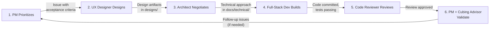

# Feature Development Loop

This document describes the 6-stage workflow for developing features in CubeHill. Every feature — from a new page to a UI component to a cube engine change — follows this loop.

## The 6 Stages

```
1. PM Prioritizes → 2. UX Designer Designs → 3. Architect Negotiates
        ↑                                              ↓
6. PM + Cubing Advisor Validate ← 5. Code Reviewer Reviews ← 4. Full-Stack Dev Builds
```



### Stage 1: PM Prioritizes

**Owner**: Product Manager

The PM decides what to build next based on project goals, user needs, and team capacity.

- Create a beads issue for the feature (`bd create --type=feature`)
- Define acceptance criteria — what "done" looks like from a product perspective
- Set priority and assign to the UX Designer for Stage 2
- For purely technical tasks (engine, renderer internals), skip to Stage 3 or Stage 4

**Handoff artifact**: Beads issue with clear title, description, and acceptance criteria.

### Stage 2: UX Designer Designs

**Owner**: UX Designer
**Collaborator**: Cubing Advisor (for domain-specific UX)

The UX Designer creates a design for the feature before any code is written. Figma is the primary design tool.

- Create designs in Figma using the figma-console MCP tools (see `docs/process/figma-tools.md`)
- Design covers: layout, interaction patterns, responsive behavior, accessibility
- Consult the Cubing Advisor for domain-specific decisions (e.g., how to display algorithms, what information beginners need)
- Use Playwright MCP browser tools for visual reference if iterating on existing UI
- Follow the mandatory visual validation workflow: create, screenshot, analyze, iterate

**Design artifacts** may include:
- Figma designs (frames, components, auto-layout, design tokens)
- Figma screenshots exported to `designs/` as reference artifacts
- Text-based layout descriptions (component placement, sizing, spacing)
- Interaction flow descriptions (what happens on click, hover, keyboard)
- Responsive breakpoint behavior (mobile vs desktop layout)
- Accessibility notes (keyboard navigation, screen reader labels)

**Handoff artifact**: Figma designs with screenshots exported to `designs/`, linked from the beads issue.

**When to skip**: Pure backend/engine tasks with no UI component (e.g., notation parser, move permutation cycles).

### Stage 3: Architect Negotiates Implementation

**Owner**: Software Architect
**Collaborators**: UX Designer, PM

The Architect reviews the design and works out the technical approach.

- Review the design for technical feasibility
- Identify which components, types, or APIs need to be created or modified
- Negotiate trade-offs with the UX Designer if the design conflicts with technical constraints
- Update relevant technical docs (`docs/technical/`) if the approach introduces new patterns
- Add implementation notes to the beads issue describing the technical approach

**Handoff artifact**: Updated `docs/technical/` page with the implementation approach (component interfaces, data flow, state changes, any new types). The wiki is the source of truth — not comments or separate design docs. For simple features with no new patterns, a beads issue comment confirming "no technical concerns" is sufficient.

**When to skip**: Simple tasks where the technical approach is obvious from the design and existing docs.

### Stage 4: Full-Stack Dev Builds

**Owner**: Full-Stack Developer
**Collaborators**: Software Architect (technical guidance), UX Designer (design clarification)

The developer implements the feature following the design and technical notes.

- Claim the beads issue (`bd update <id> --claim`)
- Follow the design artifacts in `designs/` and Figma designs (use plugin:figma:figma MCP tools to read designs — see `docs/process/figma-tools.md`)
- Follow the technical approach from Stage 3
- Write tests alongside the code (unit tests for engine, validation tests for data)
- Ask the Architect if implementation reveals a design gap — create a beads issue for the gap
- Ask the UX Designer if implementation raises UX questions not covered by the design

**Handoff artifact**: Code committed, tests passing, beads issue updated with implementation notes.

### Stage 5: Code Reviewer Reviews

**Owner**: Code Reviewer
**Focus**: Code quality, not product correctness (that's Stage 6)

The Code Reviewer checks the implementation for:
- Correctness: logic errors, edge cases, off-by-one errors
- Conventions: follows CLAUDE.md rules (immutability, SSR safety, base paths, etc.)
- Code quality: no dead code, no unused imports, types correct
- Test coverage: are the right things tested?
- Security: no XSS, injection, or other OWASP issues

**Handoff artifact**: Review feedback on the beads issue. Either approved or requests changes.

### Stage 6: PM + Cubing Advisor Validate

**Owner**: Product Manager
**Collaborator**: Cubing Advisor

Final validation that the feature works as intended.

- **PM validates**: Does it match the acceptance criteria? Does the UX match the design? Is it responsive?
- **Cubing Advisor validates**: Are algorithms correct? Is notation accurate? Would a cuber find this intuitive?
- Use Playwright MCP browser tools to verify visually
- If issues are found, create new beads issues (don't reopen the original)

**Handoff artifact**: Validation sign-off on the beads issue. Feature is done.

## Which Stages Apply?

Not every task needs all 6 stages. Use this guide:

| Task Type | Stages |
|-----------|--------|
| UI feature (new page, component) | All 6 |
| UI refinement (styling, layout tweak) | 1, 2, 4, 5, 6 |
| Engine/renderer (cube state, Three.js) | 1, 3, 4, 5 |
| Data (algorithm entries) | 1, 4, 5, 6 (Cubing Advisor validates) |
| Config/infra (CI, linting, deploy) | 1, 4, 5 |
| Docs-only | 1, 4 (write), 5 (review) |

## Beads Integration

Each feature flows through beads:
1. PM creates the issue (Stage 1)
2. Issue is assigned to UX Designer, then Architect, then Dev as it moves through stages
3. Review and validation feedback is added as issue notes
4. Issue is closed after Stage 6 validation passes

For multi-task features, create a beads epic with child tasks. Each child task can be at a different stage independently.

## Folder Ownership

| Folder | Owner | Purpose |
|--------|-------|---------|
| `designs/` | UX Designer | Design artifacts for features |
| `docs/technical/` | Software Architect | Technical documentation |
| `docs/product/` | Product Manager | Product documentation |
| `docs/process/` | Shared (PM + Architect) | Process documentation |
| `src/` | Full-Stack Developer | All application code |
