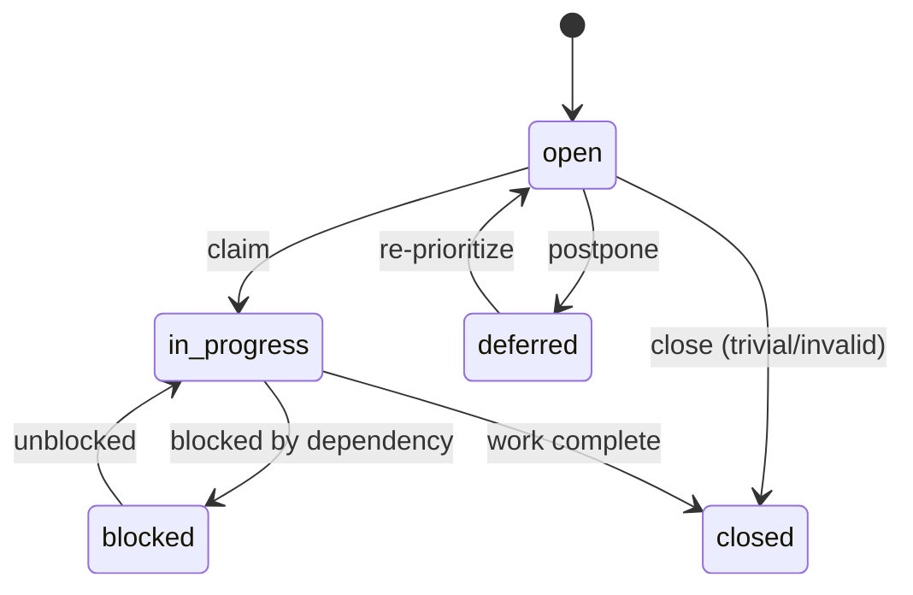

# Issue Tracking

This project uses **beads** (`bd`) for all issue tracking. This document defines the standards and best practices for how the team creates, manages, and closes issues.

Run `bd prime` for the full command reference.

## Core Principles

1. **Everything is tracked.** Any work that takes more than a couple of minutes gets a beads issue — code, docs, reviews, bug fixes, investigations.
2. **Issues are actionable.** Each issue describes a concrete piece of work with a clear "done" state. Long-term knowledge goes in `docs/`, not in issues.
3. **Claim before starting.** Always `bd update <id> --claim` before beginning work. This prevents duplicate effort and gives the team visibility into who's doing what.
4. **Close when done.** Don't leave issues lingering. Close them as soon as the work is complete and verified.
5. **One issue, one concern.** Don't bundle unrelated work into a single issue. If a review finds 3 problems, create 3 issues.

## Issue Types

| Type       | When to Use                                                            |
| ---------- | ---------------------------------------------------------------------- |
| `task`     | General work item (default). Use for most things.                      |
| `bug`      | Something is broken or incorrect.                                      |
| `feature`  | New functionality or enhancement.                                      |
| `chore`    | Maintenance, cleanup, dependency updates.                              |
| `epic`     | A larger initiative spanning multiple issues. Use `bd epic create`.    |
| `decision` | An architecture or design decision that needs to be made and recorded. |

## Labels

Use labels to categorize issues by area. Labels exist in two systems:

### GitHub Labels

These are the labels configured on the GitHub repository (used for epic-level issues):

| Label           | Area                                           |
| --------------- | ---------------------------------------------- |
| `bug`           | Something isn't working                        |
| `feature`       | Major feature work                             |
| `epic`          | Epic-level tracking issue                      |
| `cube-engine`   | Cube state, moves, notation                    |
| `rendering`     | Three.js, animation, 3D                        |
| `ui`            | Svelte components, pages, layout               |
| `infra`         | Build, CI/CD, deployment, tooling              |
| `documentation` | Improvements or additions to documentation     |
| `enhancement`   | New feature or request                         |

### Beads Labels

For granular beads issues, use these labels. They don't need to match GitHub labels exactly, but stay consistent within beads:

| Label          | Area                                                    |
| -------------- | ------------------------------------------------------- |
| `cube-engine`  | Cube state, moves, notation parser                      |
| `rendering`    | Three.js, animations, 3D visualization                  |
| `ui`           | Svelte components, pages, routing                       |
| `ux`           | User experience, interaction design, accessibility      |
| `cubing`       | Algorithm accuracy, notation, domain correctness        |
| `theming`      | DaisyUI, dark/light mode, styling                       |
| `infra`        | Build, CI/CD, deployment, tooling                       |
| `docs`         | Documentation updates                                   |
| `critical`     | Must fix — blocks progress or causes incorrect behavior |

Multiple labels can be applied to a single issue. Use `bd create -l "label1,label2"`.

## Statuses

| Status        | Meaning                                               |
| ------------- | ----------------------------------------------------- |
| `open`        | Available to work on. Not yet started.                |
| `in_progress` | Someone has claimed it and is actively working.       |
| `blocked`     | Cannot proceed — waiting on a dependency or decision. |
| `deferred`    | Intentionally postponed for later.                    |
| `closed`      | Work is complete and verified.                        |



## Writing Good Issues

### Titles

- Start with a verb: "Add", "Fix", "Update", "Review", "Verify"
- Be specific: "Fix Ua Perm algorithm notation" not "Fix algorithm"
- Keep it short but descriptive — someone should understand the scope from the title alone

### Descriptions

- **What**: What needs to be done
- **Why**: Why it matters (skip for obvious tasks)
- **Acceptance criteria**: How to know it's done (for non-trivial tasks)

Example:

```
bd create "Add touch gesture handling for mobile cube interaction" \
  -d "OrbitControls intercepts touch events, preventing page scroll on mobile. Need to implement two-finger rotate or a dedicated touch zone so scrolling works alongside cube rotation." \
  -l "ux,rendering,critical"
```

### When to Add Acceptance Criteria

- Features and enhancements: always
- Bug fixes: describe the expected behavior after the fix
- Simple tasks (typos, config changes): not needed — the title is enough
- Reviews: describe what should be reviewed and what "approved" means

## Dependencies

Use dependencies to sequence work:

```bash
bd dep add <issue> <depends-on>    # issue depends on depends-on
```

`bd ready` only shows issues with no open blockers — so dependencies automatically control what's available to work on.

## Epics

Use epics to group related issues into larger initiatives:

```bash
bd epic create "Phase 3: Cube State Engine"
bd create "Implement CubeState.ts" --parent <epic-id>
bd create "Implement moves.ts" --parent <epic-id>
bd create "Implement notation.ts" --parent <epic-id>
```

Epics correspond to implementation phases. Each phase from the project plan should be an epic.

## PM Hygiene Duties

The Product Manager is responsible for keeping the issue tracker healthy:

### Start of Session

- Run `bd stats` for an overview
- Run `bd ready` to see what's available
- Run `bd stale` to find issues that haven't been updated recently

### Periodic Checks

- **Open issues**: Are any stale, missing assignees, unclear, or blocked on resolved items?
- **Recently closed issues**: Was the work actually completed? Are there uncaptured follow-ups?
- **Consistency**: Do issues follow these standards — proper labels, clear titles, descriptions where needed?
- **Compliance**: Is every teammate tracking their work? If not, message them.

### Useful Commands

```bash
bd list                              # All open issues
bd list --all                        # Including closed
bd list -a "full-stack-dev"          # Issues by assignee
bd list -l "critical"               # Issues by label
bd list --status in_progress         # What's being worked on
bd stale                             # Issues not updated recently
bd stats                            # Overview and statistics
```

## GitHub Issues + Beads

This project uses two tracking systems at different levels of granularity:

| System            | Scope                                          | Audience                           | Lifetime    |
| ----------------- | ---------------------------------------------- | ---------------------------------- | ----------- |
| **GitHub Issues** | High-level epics, milestones, significant bugs | Stakeholders, contributors, public | Long-lived  |
| **Beads**         | Granular implementation tasks for agents       | Development team (agents)          | Short-lived |

### How They Relate

- Each **milestone** in GitHub corresponds to a project phase (Phase 1-10)
- Each **epic issue** in GitHub corresponds to a beads epic and references it by ID
- Each **beads epic** should note its GitHub Issue number in its notes field
- Granular child tasks live only in beads -- they are too fine-grained for GitHub Issues

### Responsibilities

- **PM** creates and maintains GitHub Issues for new epics and significant bugs
- **PM** keeps milestone progress up to date (close issues when epics complete)
- Each GitHub Issue body includes a `Granular tasks tracked in beads under cubehill-XXX` note
- Each beads epic should have `gh#N` in its notes (use `bd update <id> --notes "gh#N"`)

### Cross-Reference Table

| GitHub Issue                  | Milestone | Beads Epic     |
| ----------------------------- | --------- | -------------- |
| #1 Project Scaffolding        | Phase 1   | `cubehill-at3` |
| #2 Cube State Engine          | Phase 2   | `cubehill-7kx` |
| #3 Three.js 3D Renderer       | Phase 3   | `cubehill-vak` |
| #4 Svelte Integration         | Phase 4   | `cubehill-1wv` |
| #5 Algorithm Data & Browse UI | Phase 5   | `cubehill-3j2` |
| #6 Command Palette            | Phase 6   | `cubehill-cpj` |
| #7 Keyboard Controls          | Phase 7   | `cubehill-ppi` |
| #8 Theming                    | Phase 8   | `cubehill-n6o` |
| #9 Navbar & Navigation        | Phase 9   | `cubehill-3ur` |
| #10 Deployment & Final QA     | Phase 10  | `cubehill-8fz` |

## Session Workflow (All Agents)

1. `bd ready` — find available work
2. `bd update <id> --claim` — claim it
3. Do the work
4. `bd close <id>` — mark done
5. If you discover additional work, `bd create` new issues
6. End of session: `bd dolt push`, `git push`
