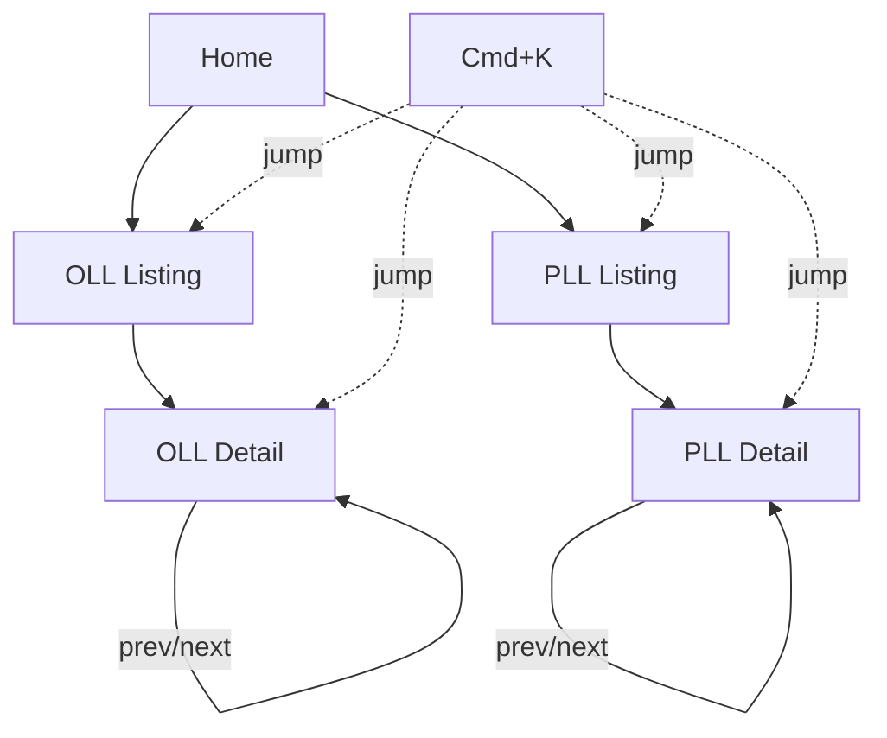
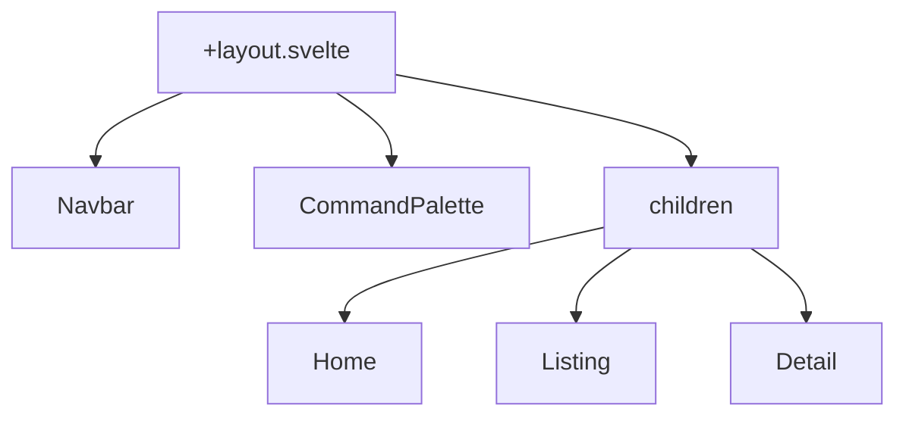

# Pages & Layout

This document describes the pages, responsive layout, and navigation structure. For component APIs, stores, and keyboard controls, see [Technical: Components](../technical/components.md).

## Pages



### Home (`src/routes/+page.svelte`)

The landing page features:

- An interactive 3D cube (via `CubeViewer`) that users can rotate with mouse/touch
- A brief introduction to CubeHill and what it offers
- Links/cards directing users to the OLL and PLL algorithm sets

The home page cube is a "hero" element — it's not tied to any specific algorithm. Users can freely orbit it to explore the 3D renderer.

### Algorithm Listing Pages (`src/routes/oll/+page.svelte`, `src/routes/pll/+page.svelte`)

Grid layouts displaying all cases for a given algorithm set:

- Uses `AlgorithmList` -> `AlgorithmCard[]` to render a categorized grid
- Cases are grouped by their `group` field (e.g., "Dot Cases", "T-Shape" for OLL)
- Each card shows the case name, a 2D pattern thumbnail, and the probability
- Clicking a card navigates to the detail page for that case

### Algorithm Detail Pages (`src/routes/oll/[id]/+page.svelte`, `src/routes/pll/[id]/+page.svelte`)

Individual algorithm visualization and playback:

- `CubeViewer` showing the cube in the unsolved state for this case
- `PlaybackControls` for stepping through the algorithm
- The algorithm notation displayed as text
- Alternative algorithms listed if `altNotations` is populated
- Navigation to previous/next cases within the same set

The unsolved state is generated by applying the **inverse** of the algorithm to a solved cube (see `invertAlgorithm` in `cube-engine.md`).

#### Dynamic Route Prerendering

The `[id]` routes use SvelteKit's `entries()` export to enumerate all valid case IDs at build time:

```typescript
// src/routes/oll/[id]/+page.ts
import { ollCases } from '$lib/data/oll';

export function entries() {
  return ollCases.map((c) => ({ id: c.id }));
}

export const prerender = true;
```

This tells `adapter-static` which pages to generate. Without `entries()`, SvelteKit cannot discover dynamic routes during prerendering.

## Responsive Layout

### Breakpoints

The layout uses Tailwind CSS breakpoints (via DaisyUI) to adapt to different screen sizes:

| Breakpoint | Width        | Layout                        |
| ---------- | ------------ | ----------------------------- |
| Mobile     | < 640px      | Single column, stacked layout |
| Tablet     | 640px-1024px | 2-column algorithm grid       |
| Desktop    | > 1024px     | 3-4 column algorithm grid     |

### Algorithm Listing Pages

```
Mobile (<640px)       Tablet (640-1024px)     Desktop (>1024px)
+--------------+      +------+-------+        +----+----+----+----+
| [  Card 1  ] |      |Card 1|Card 2 |        | C1 | C2 | C3 | C4 |
+--------------+      +------+-------+        +----+----+----+----+
| [  Card 2  ] |      |Card 3|Card 4 |        | C5 | C6 | C7 | C8 |
+--------------+      +------+-------+        +----+----+----+----+
| [  Card 3  ] |      |Card 5|Card 6 |        | C9 |C10 |C11 |C12 |
+--------------+      +------+-------+        +----+----+----+----+
```

- Algorithm cards use a responsive CSS grid: `grid-cols-1 sm:grid-cols-2 lg:grid-cols-3 xl:grid-cols-4`
- Group headers span the full width of the grid

### Algorithm Detail Pages

- On desktop: side-by-side layout with the 3D cube on the left and algorithm info/controls on the right
- On mobile: stacked layout with the cube on top and controls below
- The cube canvas maintains a square aspect ratio via `aspect-ratio: 1` or equivalent padding trick

### Navigation

- On desktop: horizontal navbar with visible links
- On mobile: DaisyUI `dropdown` menu (hamburger icon) for navigation links
- Command palette (Cmd+K) works identically on all screen sizes

### Canvas Sizing

The `CubeViewer` canvas uses a `ResizeObserver` rather than fixed dimensions. This ensures the 3D renderer adapts to any container size, whether in a full-width hero section on the home page or a constrained panel on the detail page.

## Layout Structure



The root layout (`src/routes/+layout.svelte`) provides the persistent shell:

```svelte
<Navbar />
<CommandPalette />
<main class="container mx-auto p-4">
  {@render children()}
</main>
```

- `Navbar` and `CommandPalette` are always mounted, regardless of the active page
- Page content renders via `{@render children()}` (Svelte 5 snippet syntax) within a centered container
- The layout imports no Three.js or browser-only code directly — those are deferred to child components via `onMount`

## Design Artifacts

Wireframes for the Phase 4 UI are in [`designs/phase4-wireframes.md`](../../designs/phase4-wireframes.md), with annotated screenshots at [`designs/phase4-desktop-wireframe.png`](../../designs/phase4-desktop-wireframe.png) and [`designs/phase4-mobile-wireframe.png`](../../designs/phase4-mobile-wireframe.png).
