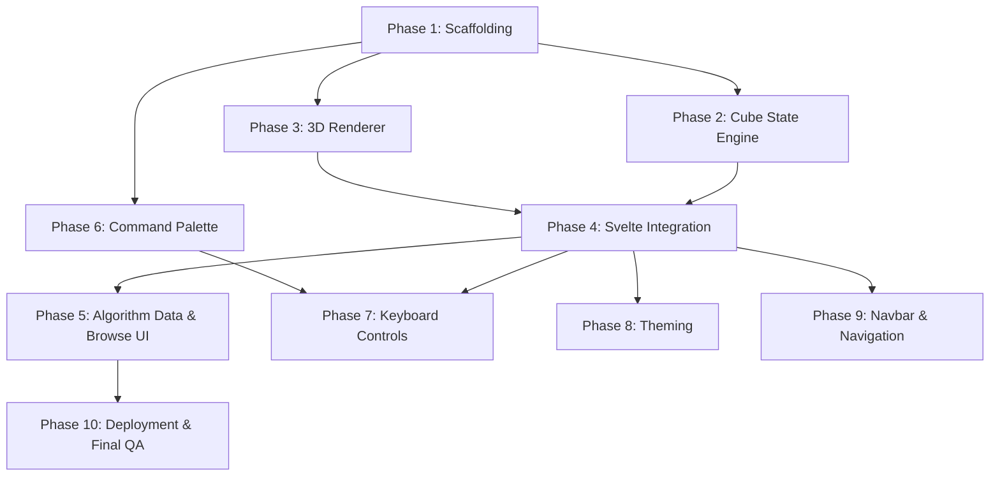

# Roadmap

This document describes the 10 phases of CubeHill development, their dependencies, and what each delivers. CubeHill is a speedcubing algorithm visualizer — a static web app with a 3D Rubik's cube, algorithm browsing UI, command palette, and keyboard controls. For stack choices, see [Stack Decisions](stack-decisions.md).

## Phase Dependencies

Phases are ordered by dependency, not by calendar date. Several phases can run in parallel when their prerequisites are met.

**Parallel opportunities:**

- After Phase 1: Phases 2, 3, and 6 can all start simultaneously
- After Phase 4: Phases 5, 7, 8, and 9 can all start simultaneously (Phase 7 also requires Phase 6)

## Current Status

**Phases 1 and 2 are complete.** Phase 4 is now blocked only on Phase 3. Phases 3 and 6 are unblocked and can start in parallel.

## Phases

### Phase 1: Project Scaffolding -- COMPLETE

**Issue**: `cubehill-at3` / [#1](https://github.com/ajmalk/cubehill/issues/1)

SvelteKit setup with all dependencies, configuration, and infrastructure in place before any feature work begins.

**Key deliverables:**

- SvelteKit project with `adapter-static`, TypeScript, Tailwind v4, DaisyUI v5
- ESLint + Prettier configuration
- Vitest + Playwright testing infrastructure
- GitHub Pages deployment pipeline (CI on PRs, deploy on push to main)
- Project documentation scaffolding (`docs/technical/`, `docs/product/`, `docs/process/`)

**Dependencies:** None — this is the starting point.

---

### Phase 2: Cube State Engine -- COMPLETE

**Issue**: `cubehill-7kx` / [#2](https://github.com/ajmalk/cubehill/issues/2)

Pure TypeScript cube state model with no rendering — the logical foundation that everything else builds on.

**Key deliverables:**

- `CubeState` as immutable `number[54]` array with `solved()` constructor
- `Color` enum with hex constants for Three.js and CSS rendering
- Move functions for all face turns (U, D, L, R, F, B) with modifiers (prime, double)
- Slice moves (M, E, S) and wide moves (Rw, Uw, etc.)
- Whole-cube rotations (x, y, z)
- Algorithm notation parser (string to move sequence, including lowercase wide shorthand)
- Inverse algorithm generation (`invertAlgorithm`)
- Algorithm data model types (`BaseAlgorithm`, `OllAlgorithm`, `PllAlgorithm`, `PermutationArrow`)
- 135 unit tests across 5 test files

**Dependencies:** Phase 1.

---

### Phase 3: Three.js 3D Renderer

**Issue**: `cubehill-vak` / [#3](https://github.com/ajmalk/cubehill/issues/3)

The 3D rendering layer — takes cube state and displays it as an interactive 3D cube.

**Key deliverables:**

- `CubeScene` — Three.js scene setup (lighting, camera, background)
- `CubeMesh` — 26 cubies with correct face colors from state
- `CubeAnimator` — smooth face-turn animations with drift prevention
- `OrbitControls` — mouse/touch rotation of the cube

**Dependencies:** Phase 1.

---

### Phase 4: Svelte Integration

**Issue**: `cubehill-1wv` / [#4](https://github.com/ajmalk/cubehill/issues/4)

Connects the cube engine and 3D renderer to Svelte's component model and reactivity system.

**Key deliverables:**

- `CubeViewer` component — wraps Three.js canvas with SSR-safe mounting
- `cubeStore` — reactive cube state with playback controls (play, pause, step, reset)
- `themeStore` — theme preference with persistence and FOUC prevention
- `PlaybackControls` component — play/pause, step forward/back, speed control

**Dependencies:** Phase 2, Phase 3.

---

### Phase 5: Algorithm Data & Browse UI

**Issue**: `cubehill-3j2` / [#5](https://github.com/ajmalk/cubehill/issues/5)

The algorithm content and browsing experience — the core user-facing feature of the app.

**Key deliverables:**

- OLL data file (57 cases) and PLL data file (21 cases)
- `AlgorithmCard` component with case name, pattern thumbnail, probability
- `AlgorithmList` component with category grouping
- Route pages: `/oll/`, `/pll/`, `/oll/[id]/`, `/pll/[id]/`
- Home page with hero cube and navigation to OLL/PLL

**Dependencies:** Phase 4.

---

### Phase 6: Command Palette

**Issue**: `cubehill-cpj` / [#6](https://github.com/ajmalk/cubehill/issues/6)

ninja-keys integration for fast algorithm search and navigation via Cmd+K / Ctrl+K.

**Key deliverables:**

- ninja-keys web component integration (SSR-safe)
- Algorithm search across all OLL and PLL cases
- Nested menus (OLL > category > case, PLL > category > case)
- Theme switching commands
- Navigation commands (Home, OLL, PLL)

**Dependencies:** Phase 1.

---

### Phase 7: Keyboard Controls

**Issue**: `cubehill-ppi` / [#7](https://github.com/ajmalk/cubehill/issues/7)

Keyboard shortcuts for cube manipulation and algorithm playback.

**Key deliverables:**

- Key mappings for playback controls (space for play/pause, arrow keys for stepping)
- Safety guards: disable shortcuts when command palette is open
- Safety guards: disable shortcuts when text inputs are focused
- Visual key binding hints in the UI

**Dependencies:** Phase 4, Phase 6.

---

### Phase 8: Theming

**Issue**: `cubehill-n6o` / [#8](https://github.com/ajmalk/cubehill/issues/8)

Full theme support across the entire app, including the 3D cube.

**Key deliverables:**

- CSS variable sync between DaisyUI themes and Three.js scene (background, lighting)
- ninja-keys styling to match the active DaisyUI theme
- Theme persistence via localStorage
- Theme verification across all components
- FOUC prevention on page load

**Dependencies:** Phase 4.

---

### Phase 9: Navbar & Navigation

**Issue**: `cubehill-3ur` / [#9](https://github.com/ajmalk/cubehill/issues/9)

Persistent navigation across all pages.

**Key deliverables:**

- `Navbar` component with links to Home, OLL, PLL
- Mobile-responsive dropdown menu (hamburger icon on small screens)
- Integration into the root layout (`+layout.svelte`)
- Active page highlighting
- Cmd+K shortcut hint in the navbar

**Dependencies:** Phase 4.

---

### Phase 10: Deployment & Final QA

**Issue**: `cubehill-8fz` / [#10](https://github.com/ajmalk/cubehill/issues/10)

Final quality pass and production deployment.

**Key deliverables:**

- Production build verification (`npm run build` succeeds, all routes prerender)
- E2E tests for critical user flows (browse algorithms, play animation, switch theme)
- Code review of the full codebase
- Cubing advisor review of algorithm data accuracy
- GitHub Pages deployment live at `ajmalk.github.io/cubehill`

**Dependencies:** Phase 5.

## Critical Path

The longest dependency chain determines the minimum number of sequential phases:

**Phase 1 > Phases 2+3 > Phase 4 > Phase 5 > Phase 10**

This is 5 sequential stages (Phases 2 and 3 run in parallel within the second stage). All other phases (6, 7, 8, 9) branch off this critical path and can be developed in parallel with it once their prerequisites are met.
