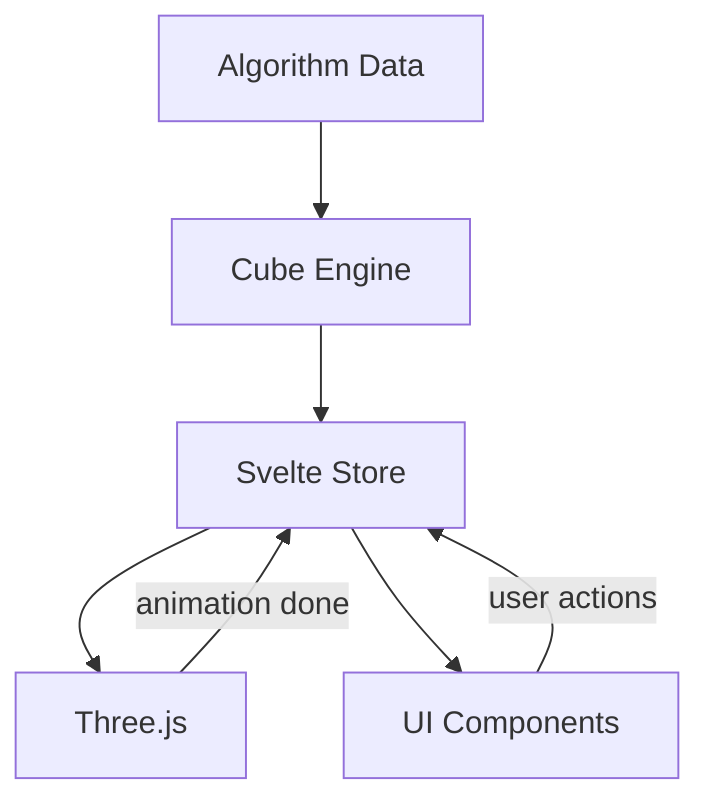

# Architecture

This document describes the project structure, data flow, and key architectural decisions for CubeHill. For the reasoning behind each technology choice, see [Product: Stack Choices](../product/stack-decisions.md).

## Project Structure

The tree below shows the **target** structure. Items marked with `*` exist after Phase 2 (Cube State Engine); unmarked items are planned for later phases.

```
cubehill/
├── .github/workflows/
│   ├── ci.yml *                        # PR checks (lint, format, test, build)
│   └── deploy.yml *                    # Deploy to GitHub Pages on push to main
├── .claude/agents/ *                   # Agent definitions for the team
├── docs/ *                             # Project wiki (this folder)
├── static/
│   └── robots.txt *                    # Search engine directives
├── src/
│   ├── app.html *                      # SvelteKit HTML shell (FOUC prevention)
│   ├── app.css *                       # Tailwind v4 / DaisyUI v5 imports
│   ├── app.d.ts *                      # SvelteKit type declarations
│   ├── lib/
│   │   ├── index.ts *                  # $lib barrel file
│   │   ├── assets/
│   │   │   └── favicon.svg *           # Site favicon
│   │   ├── cube/ *                      # Cube state engine (pure TypeScript)
│   │   │   ├── index.ts *              # Public API barrel file
│   │   │   ├── types.ts *              # Move, Algorithm, and PLL pattern types
│   │   │   ├── CubeState.ts *          # 54-sticker state model (solved())
│   │   │   ├── notation.ts *           # Algorithm notation parser
│   │   │   ├── moves.ts *             # Move definitions (permutation cycles)
│   │   │   └── colors.ts *            # Color enum, hex constants, face indices
│   │   ├── three/                      # Three.js rendering layer
│   │   │   ├── CubeScene.ts           # Scene, camera, lights, renderer
│   │   │   ├── CubeMesh.ts            # 26 cubies with sticker faces
│   │   │   ├── CubeAnimator.ts        # Face-turn animation engine
│   │   │   └── controls.ts            # OrbitControls wrapper
│   │   ├── data/                       # Static algorithm data
│   │   │   ├── oll.ts                 # 57 OLL cases
│   │   │   └── pll.ts                 # 21 PLL cases
│   │   ├── types.ts                   # Shared TypeScript types (if needed beyond cube/types.ts)
│   │   ├── stores/                     # Reactive state (Svelte 5 runes)
│   │   │   ├── cubeStore.svelte.ts    # Cube state + playback
│   │   │   ├── themeStore.svelte.ts   # Dark/light mode preference
│   │   │   └── commandPaletteStore.svelte.ts  # Palette open state + trigger
│   │   ├── commands/
│   │   │   └── commandData.ts         # ninja-keys command array builder
│   │   └── components/                 # Svelte components
│   │       ├── CubeViewer.svelte      # Three.js canvas mount point
│   │       ├── AlgorithmCard.svelte   # Algorithm case thumbnail
│   │       ├── AlgorithmList.svelte   # Grid of algorithm cards
│   │       ├── CommandPalette.svelte  # ninja-keys wrapper
│   │       ├── PlaybackControls.svelte # Play/pause/step/reset
│   │       ├── ThemeToggle.svelte     # Dark/light switch
│   │       └── Navbar.svelte          # Top navigation bar
│   └── routes/ *                       # SvelteKit file-based routing
│       ├── +layout.svelte *           # Root layout (imports CSS, favicon)
│       ├── +layout.ts *               # Prerender + trailingSlash config
│       ├── +page.svelte *             # Home page (solved cube hero + OLL/PLL nav cards)
│       ├── oll/
│       │   ├── +page.svelte           # OLL cases listing
│       │   └── [id]/+page.svelte      # Individual OLL case
│       └── pll/
│           ├── +page.svelte           # PLL cases listing
│           └── [id]/+page.svelte      # Individual PLL case
├── tests/
│   └── e2e/
│       └── smoke.test.ts *            # Basic E2E smoke test
├── svelte.config.js *                 # SvelteKit config (adapter-static)
├── vite.config.ts *                   # Vite + Vitest config
├── playwright.config.ts *             # Playwright E2E config
├── tsconfig.json *                    # TypeScript config
├── eslint.config.js *                 # ESLint flat config
├── .prettierrc *                      # Prettier config
├── .prettierignore *                  # Prettier ignore list
├── CLAUDE.md *                        # Project conventions for agents
└── package.json *
```

## Data Flow



Data flows down: static algorithm data is parsed by the cube engine into state, held in the Svelte store, and consumed by both the Three.js renderer and UI components. Feedback flows up: user actions (play, pause, step, reset, algorithm selection) and animation-complete events write back into the store, triggering the next update.

## Algorithm Data Files

Algorithm data lives in `src/lib/data/` as static TypeScript arrays exported from two files:

```typescript
// src/lib/data/oll.ts
import type { OllAlgorithm } from '$lib/cube/types';
export const oll: OllAlgorithm[] = [ /* 57 cases */ ];

// src/lib/data/pll.ts
import type { PllAlgorithm } from '$lib/cube/types';
export const pll: PllAlgorithm[] = [ /* 21 cases */ ];
```

Each file is a single named export of a typed array. There is no default export and no index barrel re-exporting both — the list and detail pages each import directly from the file they need. This keeps tree-shaking effective (a PLL page does not bundle OLL data) even though the full dataset is small enough that it would not matter in practice.

Cases are ordered by their canonical number within each file — OLL 1 through OLL 57, then the PLL perms in the standard reference order. Group order is determined by the order cases first appear in the array. `AlgorithmList` preserves this order when grouping; it does not re-sort.

See [Algorithm Data Model](./algorithm-data-model.md) for the full TypeScript type definitions.

## Key Architectural Decisions

### Separation of Concerns

The cube state engine (`src/lib/cube/`) is **pure TypeScript** with no dependencies on Three.js or Svelte. This means:

- It can be unit tested in isolation
- The state model is independent of how it's rendered
- Different renderers could be swapped in without changing the state logic

### Three.js as Imperative Side-Effect

Three.js is inherently imperative (create objects, call methods, manage a render loop). Rather than trying to make it declarative or reactive, we treat it as a side-effect:

1. `CubeViewer.svelte` creates a `<canvas>` element
2. In `onMount`, it instantiates the Three.js scene and passes the canvas
3. The Svelte component holds a reference to the scene manager
4. When cube state changes, the component calls imperative methods on the scene (e.g., `animator.animate(move)`)
5. `onDestroy` disposes the scene

This keeps the boundary clean and avoids fighting Svelte's reactivity model.

### Immutable Cube State

Every move returns a new `number[54]` array rather than mutating in place. This:

- Works naturally with Svelte 5's `$state` reactivity (assignment triggers updates)
- Makes undo/history trivial (keep an array of past states)
- Prevents bugs from shared mutable state between the store and renderer

### Static Algorithm Data

Algorithm data is stored as TypeScript constants (not fetched from an API). This means:

- Data is bundled at build time — no loading states or fetch errors
- Full type safety on the algorithm data structure
- All 78 algorithms are always available — the dataset is small enough to bundle entirely

## Routing

| Route        | Page       | Description                                                  |
| ------------ | ---------- | ------------------------------------------------------------ |
| `/`          | Home       | Solved cube hero with OLL/PLL nav cards; no playback controls |
| `/oll/`      | OLL List   | All 57 OLL cases in a categorized grid                       |
| `/oll/[id]/` | OLL Detail | Single OLL case with 3D visualizer and playback              |
| `/pll/`      | PLL List   | All 21 PLL cases in a categorized grid                       |
| `/pll/[id]/` | PLL Detail | Single PLL case with 3D visualizer and playback              |

All routes are statically prerendered at build time via `adapter-static`. Dynamic `[id]` routes use `entries()` to enumerate all valid IDs.

### Static Prerendering for Dynamic Routes

`adapter-static` cannot discover dynamic route parameters on its own — you must tell it which IDs exist. Each dynamic route needs a `+page.ts` that exports an `entries` function:

```typescript
// src/routes/oll/[id]/+page.ts
import { oll } from '$lib/data/oll';

export const entries = () => oll.map((a) => ({ id: a.id }));
export const prerender = true;
```

The same pattern applies to `pll/[id]/+page.ts` using the `pll` array. The root `+layout.ts` already sets `prerender = true` globally; the `entries` export tells the adapter which `[id]` values to generate pages for.

### ID Format

The `id` field on each algorithm is the URL slug: `"oll-1"`, `"oll-2"`, ..., `"pll-aa"`, `"pll-t"`. This is a human-readable string, not a numeric index. Using the string form directly as the URL segment (e.g., `/oll/oll-1/`) is redundant but unambiguous and avoids collisions between OLL and PLL IDs in the URL namespace.

Alternative considered: use `"1"` through `"57"` as the `[id]` for OLL and named slugs like `"t"` or `"aa"` for PLL. Rejected because it would require the load function to distinguish OLL numeric IDs from PLL name-based IDs with separate lookup logic, and because OLL cases do not have universally agreed short names — the number is the canonical identifier. Using `"oll-1"` as both the `id` field and the URL segment keeps the data model and routing consistent.

### Load Function Pattern

Each detail page has a `+page.ts` that handles data loading and 404s:

```typescript
// src/routes/oll/[id]/+page.ts
import { oll } from '$lib/data/oll';
import { error } from '@sveltejs/kit';
import type { EntryGenerator, PageLoad } from './$types';

export const entries: EntryGenerator = () => oll.map((a) => ({ id: a.id }));
export const prerender = true;

export const load: PageLoad = ({ params }) => {
  const algorithm = oll.find((a) => a.id === params.id);
  if (!algorithm) error(404, `OLL case "${params.id}" not found`);
  return { algorithm };
};
```

The `error()` call from `@sveltejs/kit` triggers SvelteKit's error page. Because all valid IDs are enumerated by `entries`, a 404 should never occur in production — it is a safety net for development-time typos.

## Component Hierarchy

Target hierarchy for Phase 5. The Navbar and CommandPalette move to `+layout.svelte` so they are present on every page. The home page transitions from the T Perm demo to a proper landing page with a solved cube hero.

```
+layout.svelte
├── Navbar
├── CommandPalette (global, ninja-keys)
└── {@render children()} (page content)
    ├── Home (+page.svelte)
    │   └── CubeViewer (solved cube, no playback controls)
    ├── OLL List (oll/+page.svelte)
    │   └── AlgorithmList → AlgorithmCard[]
    ├── OLL Detail (oll/[id]/+page.svelte)
    │   ├── CubeViewer
    │   └── PlaybackControls
    ├── PLL List (pll/+page.svelte)
    │   └── AlgorithmList → AlgorithmCard[]
    └── PLL Detail (pll/[id]/+page.svelte)
        ├── CubeViewer
        └── PlaybackControls
```

**Current state (post-Phase 6):** Navbar and CommandPalette are both in `+layout.svelte` and mounted on every page. The home page is the solved-cube landing page with OLL/PLL nav cards. The command palette is fully implemented with Navigation, OLL, PLL, and Theme sections.
