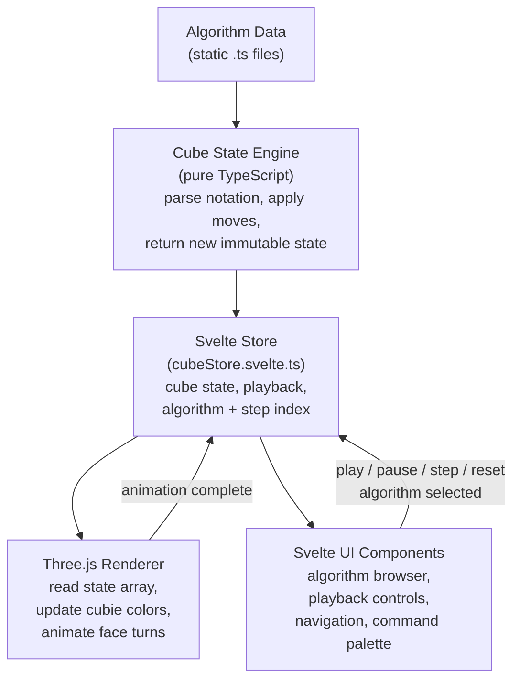

# Architecture

This document describes the project structure, data flow, and key architectural decisions for CubeHill. For the reasoning behind each technology choice, see [Product: Stack Choices](../product/stack-decisions.md).

## Project Structure

```
cubehill/
├── .github/workflows/deploy.yml        # GitHub Actions deploy to GitHub Pages
├── .claude/agents/                     # Agent definitions for the team
├── docs/                               # Project wiki (this folder)
├── static/
│   └── .nojekyll                       # Bypass Jekyll on GitHub Pages
├── src/
│   ├── app.html                        # SvelteKit HTML shell
│   ├── app.css                         # Tailwind/DaisyUI imports
│   ├── lib/
│   │   ├── cube/                       # Cube state engine (pure TypeScript)
│   │   │   ├── CubeState.ts            # 54-sticker state model
│   │   │   ├── notation.ts             # Algorithm notation parser
│   │   │   ├── moves.ts               # Move definitions (permutation cycles)
│   │   │   └── colors.ts              # Color enum and constants
│   │   ├── three/                      # Three.js rendering layer
│   │   │   ├── CubeScene.ts           # Scene, camera, lights, renderer
│   │   │   ├── CubeMesh.ts            # 26 cubies with sticker faces
│   │   │   ├── CubeAnimator.ts        # Face-turn animation engine
│   │   │   └── controls.ts            # OrbitControls wrapper
│   │   ├── data/                       # Static algorithm data
│   │   │   ├── oll.ts                 # 57 OLL cases
│   │   │   └── pll.ts                 # 21 PLL cases
│   │   ├── types.ts                   # Shared TypeScript types
│   │   ├── stores/                     # Reactive state (Svelte 5 runes)
│   │   │   ├── cubeStore.svelte.ts    # Cube state + playback
│   │   │   └── themeStore.svelte.ts   # Dark/light mode preference
│   │   └── components/                 # Svelte components
│   │       ├── CubeViewer.svelte      # Three.js canvas mount point
│   │       ├── AlgorithmCard.svelte   # Algorithm case thumbnail
│   │       ├── AlgorithmList.svelte   # Grid of algorithm cards
│   │       ├── CommandPalette.svelte  # ninja-keys wrapper
│   │       ├── PlaybackControls.svelte # Play/pause/step/reset
│   │       ├── ThemeToggle.svelte     # Dark/light switch
│   │       └── Navbar.svelte          # Top navigation bar
│   └── routes/                         # SvelteKit file-based routing
│       ├── +layout.svelte             # Root layout (navbar, command palette)
│       ├── +layout.ts                 # Prerender config
│       ├── +page.svelte               # Home page
│       ├── oll/
│       │   ├── +page.svelte           # OLL cases listing
│       │   └── [id]/+page.svelte      # Individual OLL case
│       └── pll/
│           ├── +page.svelte           # PLL cases listing
│           └── [id]/+page.svelte      # Individual PLL case
├── svelte.config.js                   # SvelteKit config (adapter-static)
├── vite.config.ts                     # Vite config
├── tailwind.config.js                 # Tailwind + DaisyUI config
├── tsconfig.json                      # TypeScript config
├── CLAUDE.md                          # Project conventions for agents
└── package.json
```

## Data Flow



The downward arrows show data flowing from static algorithm data through the engine and store to the rendering and UI layers. The upward feedback arrows show user actions (from playback controls, algorithm selection, and keyboard shortcuts) and animation-complete events flowing back into the store, which then triggers the next state update.

## Key Architectural Decisions

### Separation of Concerns

The cube state engine (`src/lib/cube/`) is **pure TypeScript** with no dependencies on Three.js or Svelte. This means:
- It can be unit tested in isolation
- The state model is independent of how it's rendered
- Different renderers could be swapped in without changing the state logic

### Three.js as Imperative Side-Effect

Three.js is inherently imperative (create objects, call methods, manage a render loop). Rather than trying to make it declarative or reactive, we treat it as a side-effect:

1. `CubeViewer.svelte` creates a `<canvas>` element
2. In `onMount`, it instantiates the Three.js scene and passes the canvas
3. The Svelte component holds a reference to the scene manager
4. When cube state changes, the component calls imperative methods on the scene (e.g., `animator.animate(move)`)
5. `onDestroy` disposes the scene

This keeps the boundary clean and avoids fighting Svelte's reactivity model.

### Immutable Cube State

Every move returns a new `number[54]` array rather than mutating in place. This:
- Works naturally with Svelte 5's `$state` reactivity (assignment triggers updates)
- Makes undo/history trivial (keep an array of past states)
- Prevents bugs from shared mutable state between the store and renderer

### Static Algorithm Data

Algorithm data is stored as TypeScript constants (not fetched from an API). This means:
- Data is bundled at build time — no loading states or fetch errors
- Full type safety on the algorithm data structure
- All 78 algorithms are always available — the dataset is small enough to bundle entirely

## Routing

| Route | Page | Description |
|-------|------|-------------|
| `/` | Home | Interactive cube hero, introduction, links to algorithm sets |
| `/oll/` | OLL List | All 57 OLL cases in a categorized grid |
| `/oll/[id]/` | OLL Detail | Single OLL case with 3D visualizer and playback |
| `/pll/` | PLL List | All 21 PLL cases in a categorized grid |
| `/pll/[id]/` | PLL Detail | Single PLL case with 3D visualizer and playback |

All routes are statically prerendered at build time via `adapter-static`. Dynamic `[id]` routes use `entries()` to enumerate all valid IDs.

## Component Hierarchy

```
+layout.svelte
├── Navbar
├── CommandPalette (global, always mounted)
└── <slot> (page content)
    ├── Home (+page.svelte)
    │   └── CubeViewer (interactive demo)
    ├── OLL List (oll/+page.svelte)
    │   └── AlgorithmList → AlgorithmCard[]
    ├── OLL Detail (oll/[id]/+page.svelte)
    │   ├── CubeViewer
    │   └── PlaybackControls
    ├── PLL List (pll/+page.svelte)
    │   └── AlgorithmList → AlgorithmCard[]
    └── PLL Detail (pll/[id]/+page.svelte)
        ├── CubeViewer
        └── PlaybackControls
```
