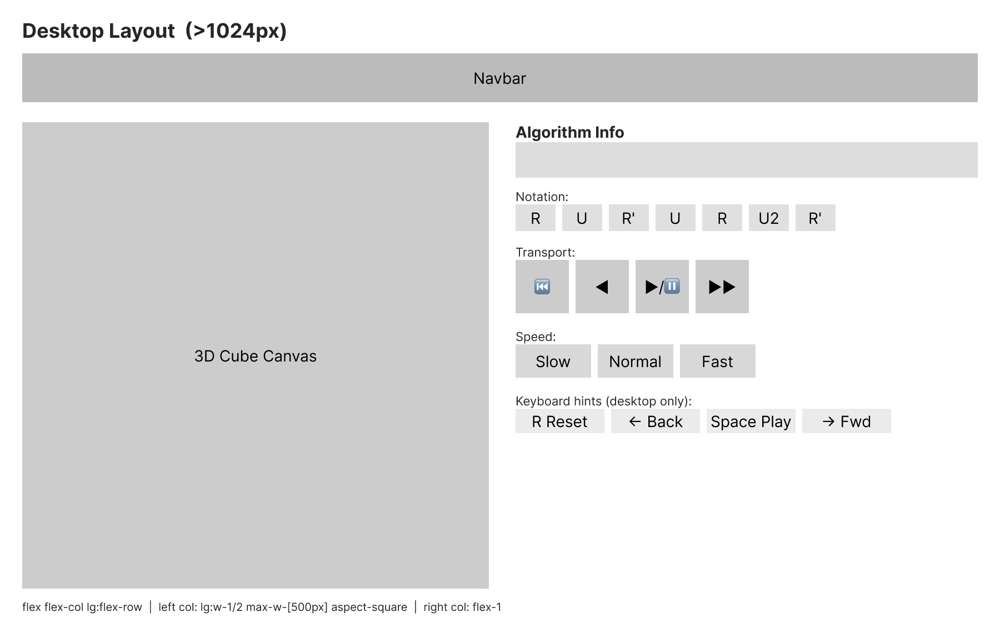
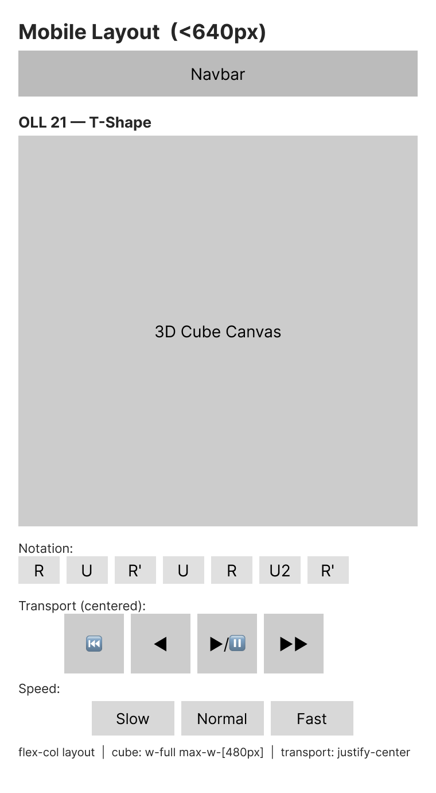

# Components & Interaction

This document describes the Svelte component APIs, reactive stores, keyboard controls, and command palette integration. For page descriptions and user flows, see [Product: Pages & Layout](../product/pages-and-layout.md).

## Components

**Current state (post-Phase 5):** `CubeViewer`, `PlaybackControls`, `ThemeToggle`, `AlgorithmList`, `AlgorithmCard`, and `Navbar` are implemented. `CommandPalette` is the Phase 6 target described below as a spec.

### CubeViewer (`src/lib/components/CubeViewer.svelte`)

The 3D cube canvas mount point. See `rendering.md` for full details on the Three.js integration.

Key responsibilities:

- Creates a `<canvas>` element sized to fit its container, inside a `relative`-positioned wrapper
- Instantiates `CubeScene`, `CubeMesh`, and `CubeAnimator` in `onMount` (Three.js must not run server-side)
- Registers/unregisters the `CubeAnimator` with `cubeStore` via `cubeStore.setAnimator()` / `cubeStore.clearAnimator()`
- Attaches a `ResizeObserver` for responsive canvas sizing
- Shows a DaisyUI loading spinner overlay until `onMount` completes; shows an error state if WebGL is unavailable
- Sets `touch-action: none` on the canvas to prevent browser scroll interception during orbit
- Toggles `cursor: grab` / `cursor: grabbing` on the container via `mousedown`/`mouseup`
- Handles double-click to reset the camera to its default position (400ms ease-out cubic tween)
- Syncs the scene background with the current theme via a `$effect` that runs whenever `themeStore.theme` changes
- Calls `scene.dispose()` on component destroy to clean up WebGL resources

**Props:** None. `CubeViewer` takes no props. All interaction (load, step, play, reset) is driven through `cubeStore`.

`PlaybackControls` reads and writes `cubeStore`; `CubeViewer` registers its animator with the store on mount so the store can delegate animation to it.

### AlgorithmList (`src/lib/components/AlgorithmList.svelte`)

Renders a grouped grid of `AlgorithmCard` components for a single algorithm category.

**Props:**

```typescript
interface AlgorithmListProps {
  algorithms: Algorithm[]; // All OLL or all PLL cases — pre-filtered by the page
}
```

Rendering behavior:

- Groups items by `algorithm.group` using a `Map<string, Algorithm[]>` built once at render time; preserves the natural order of the data array (do not sort groups alphabetically — group order in the source data is intentional)
- Renders a `<h2>` section header for each group, then a CSS grid of `AlgorithmCard` beneath it
- Grid is responsive: 2 columns on mobile, 3 on `sm`, 4 on `md`, 5 on `lg`
- No internal state — purely a presentation component driven by its `algorithms` prop

### AlgorithmCard (`src/lib/components/AlgorithmCard.svelte`)

A clickable card representing a single algorithm case. Links to the detail page.

**Props:**

```typescript
interface AlgorithmCardProps {
  algorithm: Algorithm;
}
```

Rendering:

- Uses `resolve()` from `$app/paths` to build the href (`/oll/{id}/` or `/pll/{id}/`) — required for the GitHub Pages subpath
- Derives the href from `algorithm.category` and `algorithm.id`: `resolve(\`/${algorithm.category}/${algorithm.id}/\`)`
- Displays the case name (`algorithm.name`) and group label (`algorithm.group`)
- Renders a 2D pattern thumbnail (see Pattern Thumbnails below)
- Shows `algorithm.probability` as a secondary label

### Pattern Thumbnails

Both `AlgorithmCard` variants render a 2D thumbnail as an inline SVG — no canvas, no external images, no runtime dependencies.

#### OLL Thumbnail

The OLL `pattern` field is a `boolean[9]` in row-major order. Render it as a 3x3 grid:

- Each cell is a colored square: yellow (`oklch(85% 0.2 95)`) if `true`, grey (`oklch(40% 0 0)`) if `false`
- Draw a thin white border between cells
- The center cell (`pattern[4]`) is always `true`
- Size: 48x48px intrinsic, scales with CSS. No viewBox tricks — use a fixed `viewBox="0 0 3 3"` with `1` unit per cell

This is the simplest possible approach: 9 `<rect>` elements, no library, no runtime logic beyond indexing the boolean array.

#### PLL Thumbnail

The PLL `pattern` field is a `PermutationArrow[]`. Each arrow shows where a piece moves. Render:

- A 3x3 grid background (all grey cells — top face is already solved in PLL)
- One `<line>` or curved `<path>` per arrow, drawn from the center of the `from` cell to the center of the `to` cell
- Arrowhead: use an SVG `<marker>` with `markerEnd`
- Use a distinct color (e.g., accent color via `currentColor`) for arrows so they read clearly over the grey grid

Cell center positions follow the same 3x3 grid as OLL. Position index to (col, row): `col = index % 3`, `row = Math.floor(index / 3)`, center = `(col + 0.5, row + 0.5)` in the `0 0 3 3` viewBox.

**Why SVG (not Canvas or CSS grid)**: SVG is markup — it renders server-side, works with `adapter-static` prerendering, requires no `onMount`, and scales cleanly at any DPI. Canvas requires `onMount` and would need a ref per card (expensive at 57 OLL + 21 PLL cards on the list page). CSS grid can do the OLL thumbnail but cannot draw PLL arrows. Inline SVG handles both cases uniformly with no runtime cost.

### AlgorithmDetailPage (route component: `oll/[id]/+page.svelte`, `pll/[id]/+page.svelte`)

Not a reusable component — this is the SvelteKit page file for each detail route. The two routes share the same layout and composition, differing only in which data array they read from.

Structure:

```
[id]/+page.svelte
├── <svelte:head> — page title + meta description
├── Navbar (from layout)
├── <h1> case name + breadcrumb
├── <p> notation string
├── Two-column layout (same pattern as current home page)
│   ├── CubeViewer (left / top on mobile)
│   └── PlaybackControls (right / below on mobile)
└── Keyboard controls (same as home page, copied pattern)
```

Data loading: use SvelteKit's `+page.ts` (not `+page.server.ts` — this is a static site). The load function imports from `$lib/data/oll` or `$lib/data/pll`, finds the matching case by `id`, and returns it. If not found, call `error(404)` from `@sveltejs/kit`.

The page's `onMount` calls `cubeStore.loadAlgorithm(algorithm.notation)` — same pattern as the current home page's `T_PERM` demo.

### PlaybackControls (`src/lib/components/PlaybackControls.svelte`)

Transport controls for stepping through an algorithm:

| Button       | Action                                        |
| ------------ | --------------------------------------------- |
| Play / Pause | Start or pause auto-playback of the algorithm |
| Step Forward | Advance one move and animate it               |
| Step Back    | Revert one move (apply the inverse)           |
| Reset        | Return the cube to the initial unsolved state |

Playback state is managed by `cubeStore.svelte.ts`, which tracks the current algorithm, the step index, and the play/pause flag.

### Navbar (`src/lib/components/Navbar.svelte`)

Top navigation bar using DaisyUI's `navbar` component:

- Logo/title linking to home
- Navigation links to OLL and PLL pages
- `ThemeToggle` component for dark/light mode switching
- All links use `resolve()` from `$app/paths` to build hrefs (required for GitHub Pages subpath deployment)

### ThemeToggle (`src/lib/components/ThemeToggle.svelte`)

A toggle switch for dark/light mode:

- Reads and writes the theme preference via `themeStore.svelte.ts`
- Sets the `data-theme` attribute on the `<html>` element
- Persists the user's choice to `localStorage`
- See `theme-integration.md` for full details on the theming system

### CommandPalette (`src/lib/components/CommandPalette.svelte`)

Wraps the `ninja-keys` web component. See the Command Palette section below for full details.

## Command Palette

The command palette is powered by `ninja-keys`, a framework-agnostic web component that provides a Cmd+K / Ctrl+K search interface with nested menus.

### Mounting

`CommandPalette.svelte` is mounted once in `+layout.svelte` so it's available on every page. The `ninja-keys` element is imported dynamically inside `onMount` to avoid SSR issues (it requires browser APIs):

```svelte
<script>
  import { onMount } from 'svelte';
  import { browser } from '$app/environment';

  let ninjaKeys: HTMLElement;

  onMount(async () => {
    await import('ninja-keys');
    // Configure commands after the element is defined
    ninjaKeys.data = buildCommands();
  });
</script>

{#if browser}
  <ninja-keys bind:this={ninjaKeys}></ninja-keys>
{/if}
```

### Command Structure

Commands are organized as a nested menu:

```
Root
├── OLL → (opens nested menu)
│   ├── OLL 1
│   ├── OLL 2
│   ├── ...
│   └── OLL 57
├── PLL → (opens nested menu)
│   ├── Aa Perm
│   ├── Ab Perm
│   ├── ...
│   └── Z Perm
├── Toggle Theme
└── Home
```

Each command includes:

- `id`: Unique identifier
- `title`: Display text (e.g., "OLL 1 — Dot Cases")
- `parent`: ID of parent menu for nesting (e.g., OLL cases have `parent: 'oll'`)
- `handler`: Navigation function using `goto(resolve('/oll/oll-1/'))` — `resolve()` from `$app/paths` handles the GitHub Pages subpath
- `keywords`: Additional search terms (e.g., the algorithm notation itself, so users can search by moves)

### Search

ninja-keys provides built-in fuzzy search. The `keywords` field on each command enhances discoverability:

- Searching "T Perm" finds the T Perm PLL case
- Searching "R U R'" finds algorithms that contain those moves
- Searching "dot" finds OLL cases in the "Dot Cases" group

### Open/Close Events

The command palette dispatches events when it opens and closes. These events are used to disable cube keyboard shortcuts while the palette is open (see Keyboard Controls below).

## Keyboard Controls

### Cube Controls

When viewing an algorithm detail page, keyboard shortcuts allow quick interaction:

| Key             | Action                          |
| --------------- | ------------------------------- |
| Space           | Play / Pause                    |
| → (Right Arrow) | Step forward one move           |
| ← (Left Arrow)  | Step back one move              |
| R               | Reset to initial state          |
| Escape          | Close command palette (if open) |

### Safety Guards

Keyboard shortcuts must be disabled in two situations to prevent conflicts:

1. **Command palette is open**: When ninja-keys is open, all keypresses should go to its search input, not the cube. Listen for the palette's open/close events and set a flag.

2. **Text input is focused**: If a user is typing in any `<input>`, `<textarea>`, or `contenteditable` element, keyboard shortcuts should not fire. Check `document.activeElement` before processing keystrokes.

```typescript
function handleKeydown(event: KeyboardEvent) {
  // Don't intercept when command palette is open
  if (commandPaletteOpen) return;

  // Don't intercept when typing in an input
  const tag = document.activeElement?.tagName;
  if (tag === 'INPUT' || tag === 'TEXTAREA') return;
  if ((document.activeElement as HTMLElement)?.isContentEditable) return;

  switch (event.key) {
    case ' ':
      event.preventDefault();
      togglePlayback();
      break;
    case 'ArrowRight':
      stepForward();
      break;
    case 'ArrowLeft':
      stepBack();
      break;
    case 'r':
      resetCube();
      break;
  }
}
```

### Event Listener Lifecycle

The keydown listener is added in `onMount` and removed in `onDestroy` to prevent memory leaks and stale handlers when navigating between pages.

## Reactive State (Svelte Stores)

### cubeStore (`src/lib/stores/cubeStore.svelte.ts`)

Manages the cube state and playback using Svelte 5 runes:

```typescript
let cubeState = $state(solved());         // Current cube state (number[54])
let moves = $state<Move[]>([]);           // Parsed moves of the loaded algorithm
let moveTokens = $state<string[]>([]);    // Notation tokens for the UI display
let initialState = $state<number[]>(solved()); // Pre-algorithm starting state
let stepIndex = $state(0);               // Current step (0 = no moves applied)
let isPlaying = $state(false);           // Whether auto-playback is active
let playbackStatus = $state<'idle' | 'playing' | 'paused'>('idle');
let speed = $state<SpeedSetting>('normal');
let history = $state<number[][]>([]);    // State history for undo/step-back
// (module-level, not $state — not reactive)
let playGeneration = 0;                  // Generation counter for play loop cancellation
let animationInFlight = false;           // True while play() is mid-await on an animation
```

Key operations:

- **loadAlgorithm(notation: string)**: Parse notation, apply the inverse to a solved cube to get the unsolved starting state, reset all playback state, sync the animator via `animator.loadAlgorithm()`.
- **stepForward()**: Checks `animationInFlight` first — if the play loop is currently awaiting an animation, that loop has already applied the move and we must not double-apply it. If no animation is in-flight, pushes state to history, applies the move, advances `stepIndex`, and calls `animator.animate(move, [...cubeState])`. Always passes the post-move state to the animator (see targetState pattern in `rendering.md`).
- **stepBack()**: Pops history to restore previous state, decrements `stepIndex`, calls `animator.loadAlgorithm()` to resync the animator queue.
- **play()**: Runs an async loop using a generation counter. Each call increments `playGeneration` and captures the current generation. After every `await animator.animate(...)`, the loop checks if its generation is still current — if `pause()` or any interruption fired during the await, the generation will differ and the loop exits without touching state. Sets `animationInFlight = true` around each await so `stepForward()` can detect the in-flight animation.
- **pause()**: Increments `playGeneration` to invalidate the current play loop. The loop detects this on its next generation check and exits.
- **reset()**: Restores `initialState`, clears history and `stepIndex`, syncs the animator via `animator.loadAlgorithm()`.
- **setAnimator(anim)**: Called by `CubeViewer` after `onMount`. Registers the animator and loads any current algorithm into it.
- **clearAnimator()**: Called by `CubeViewer` on destroy. Increments `playGeneration` to cancel any running loop and nullifies the animator reference.

Note: The store owns the playback sequencing loop (not the animator). The `CubeAnimator` handles the visual face-turn animation for individual moves; the store drives the step-by-step logic. The store is the single source of truth for logical cube state — it always passes `targetState` to `animator.animate()` rather than letting the animator compute its own state.

### themeStore (`src/lib/stores/themeStore.svelte.ts`)

Manages the dark/light mode preference. See `theme-integration.md` for details.

## Home Page Architecture (Phase 5)

The home page transitions from a hardcoded T Perm demo to a proper landing page. The cube on the home page does not auto-rotate or run through an algorithm on its own — it loads in the solved state and sits idle. This keeps the home page simple and avoids surprising the user with motion they did not initiate.

Recommended home page structure for Phase 5:

- Navbar (moved out of `+page.svelte` into `+layout.svelte`)
- Hero section: centered `CubeViewer` showing the solved cube, with a headline and brief description
- Call-to-action links to `/oll/` and `/pll/`
- No `PlaybackControls` on the home page — the cube is not in playback mode

The solved cube hero is purely visual. `CubeViewer` already supports this: if `cubeStore.loadAlgorithm()` is never called, the cube renders in the solved state with no animation. The home page `onMount` should call nothing on `cubeStore`.

## SEO and Page Metadata

All pages use `<svelte:head>` to set the title and meta description. These are rendered into the static HTML at prerender time and are fully SEO-compatible.

### Title and Description Patterns

| Route | Title | Description |
|-------|-------|-------------|
| `/` | `CubeHill — Speedcubing Algorithm Visualizer` | `Visualize OLL and PLL algorithms with an interactive 3D Rubik's cube.` |
| `/oll/` | `OLL Algorithms — CubeHill` | `All 57 OLL cases with 3D visualizer and step-by-step playback.` |
| `/pll/` | `PLL Algorithms — CubeHill` | `All 21 PLL cases with 3D visualizer and step-by-step playback.` |
| `/oll/[id]/` | `{name} — OLL — CubeHill` | `{name}: {group}. Algorithm: {notation}` |
| `/pll/[id]/` | `{name} — PLL — CubeHill` | `{name}: {group}. Algorithm: {notation}` |

The detail page title uses the algorithm's `name` field (e.g., "OLL 1" or "T Perm"). The description includes the notation so the algorithm moves appear in search snippets — useful for cubers who search by move sequence.

No structured data (JSON-LD) is needed for Phase 5. The static title and description are sufficient.

## Design Artifacts

The Phase 4 Svelte integration design (component hierarchy, store contracts, and interaction patterns) is documented in [`designs/phase4-svelte-integration.md`](../../designs/phase4-svelte-integration.md). Wireframes showing how these components are laid out on each page are in [`designs/phase4-wireframes.md`](../../designs/phase4-wireframes.md). The Figma source is in file `fiCCEbCrIIZqYVIm9XTjiD`, page **Phase 4 — CubeViewer & PlaybackControls**:

- [Desktop wireframe (Figma)](https://www.figma.com/design/fiCCEbCrIIZqYVIm9XTjiD?node-id=16-463) — frame `16:463`
- [Mobile wireframe (Figma)](https://www.figma.com/design/fiCCEbCrIIZqYVIm9XTjiD?node-id=16-512) — frame `16:512`



