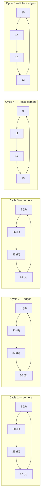

# Cube State Engine

This document describes the design of the cube state model, move definitions, and notation parser. All cube engine code lives in `src/lib/cube/` and is pure TypeScript with no framework dependencies.

## State Representation

The cube state is a `number[54]` array where each element represents one sticker. Each value is a color (0–5). The indices map to face positions as follows:

### Face Index Ranges

| Face | Indices | Color (solved) |
|------|---------|----------------|
| U (Up/Top) | 0–8 | White (0) |
| R (Right) | 9–17 | Red (1) |
| F (Front) | 18–26 | Green (2) |
| D (Down/Bottom) | 27–35 | Yellow (3) |
| L (Left) | 36–44 | Orange (4) |
| B (Back) | 45–53 | Blue (5) |

### Sticker Layout Within a Face

Each face uses row-major order, top-left to bottom-right:

```
Face indices (e.g., U face = indices 0-8):

┌───┬───┬───┐
│ 0 │ 1 │ 2 │
├───┼───┼───┤
│ 3 │ 4 │ 5 │
├───┼───┼───┤
│ 6 │ 7 │ 8 │
└───┴───┴───┘
```

### Unfolded Cube Net (All 54 Sticker Indices)

The full cube state laid out as an unfolded cross-shaped net. Each cell shows its absolute index in the `number[54]` array:

```
                  ┌────┬────┬────┐
                  │  0 │  1 │  2 │
                  ├────┼────┼────┤
              U   │  3 │  4 │  5 │
                  ├────┼────┼────┤
                  │  6 │  7 │  8 │
   ┌────┬────┬────┼────┼────┼────┼────┬────┬────┬────┬────┬────┐
   │ 36 │ 37 │ 38 │ 18 │ 19 │ 20 │  9 │ 10 │ 11 │ 53 │ 52 │ 51 │
   ├────┼────┼────┼────┼────┼────┼────┼────┼────┼────┼────┼────┤
 L │ 39 │ 40 │ 41 │ 21 │ 22 │ 23 │ 12 │ 13 │ 14 │ 50 │ 49 │ 48 │ B
   ├────┼────┼────┼────┼────┼────┼────┼────┼────┼────┼────┼────┤
   │ 42 │ 43 │ 44 │ 24 │ 25 │ 26 │ 15 │ 16 │ 17 │ 47 │ 46 │ 45 │
   └────┴────┴────┼────┼────┼────┼────┴────┴────┴────┴────┴────┘
                  │ 27 │ 28 │ 29 │
                  ├────┼────┼────┤
              D   │ 30 │ 31 │ 32 │
                  ├────┼────┼────┤
                  │ 33 │ 34 │ 35 │
                  └────┴────┴────┘
```

Faces read left-to-right, top-to-bottom (row-major) within each face. The B face appears mirrored because it is viewed from the front of the cube (looking through to the back).

So for the R face, index 9 is top-left of the R face, index 13 is the center, index 17 is bottom-right.

### Color Enum

```typescript
enum Color {
  White  = 0,  // U face
  Red    = 1,  // R face
  Green  = 2,  // F face
  Yellow = 3,  // D face
  Orange = 4,  // L face
  Blue   = 5,  // B face
}
```

This follows the standard Western color scheme with White on top and Green facing the solver.

## Immutability

The cube state is **immutable**. Every function that modifies the state returns a **new** array:

```typescript
function applyMove(state: number[], move: Move): number[] {
  const next = [...state];
  // apply permutation cycles to `next`
  return next;
}
```

This ensures:
- Svelte 5 `$state` reactivity triggers on reassignment
- Undo/history is trivial (keep previous state references)
- No bugs from shared mutable references

## Move Definitions

Each move is defined as a set of **4-cycles** — groups of 4 sticker indices that rotate into each other's positions.

### Example: R Move

The R move rotates the right face 90° clockwise (when looking at the R face). This cycles:
- 4 sets of stickers around the R/U/F/D/B faces
- Plus a rotation of the R face itself (corners and edges of the face)

```typescript
const R_CYCLES: [number, number, number, number][] = [
  // Stickers that cycle around the R layer
  [2, 20, 29, 47],   // corner stickers
  [5, 23, 32, 50],   // edge stickers
  [8, 26, 35, 53],   // corner stickers
  // R face rotation (the face itself turns)
  [9, 11, 17, 15],   // face corner stickers
  [10, 14, 16, 12],  // face edge stickers
];
```

The three "around the layer" cycles move stickers between the U, F, D, and B faces along the right column. The two "face rotation" cycles spin the R face itself. Visualized as loops:



Each arrow means "the sticker at the source index moves to the destination index" for a clockwise R move. For R', the arrows reverse.

### Move Variants

- **Clockwise** (e.g., R): Apply each 4-cycle forward: `a→b→c→d→a`
- **Counter-clockwise / Prime** (e.g., R'): Apply each 4-cycle in reverse: `a→d→c→b→a`
- **Double** (e.g., R2): Apply the clockwise move twice

### All 18 Basic Moves

The 6 faces × 3 modifiers = 18 basic moves:

```
U, U', U2    (Up)
D, D', D2    (Down)
R, R', R2    (Right)
L, L', L2    (Left)
F, F', F2    (Front)
B, B', B2    (Back)
```

### Additional Moves

**Slice moves** (middle layers):
- `M` — Middle layer (between L and R, follows L direction)
- `E` — Equatorial layer (between U and D, follows D direction)
- `S` — Standing layer (between F and B, follows F direction)

**Wide moves** (face + adjacent slice):
- `Rw` (or `r`) — R + M' (right two layers)
- `Lw` (or `l`) — L + M (left two layers)
- `Uw` (or `u`) — U + E' (top two layers)
- etc.

**Whole-cube rotations**:
- `x` — Rotate entire cube in the R direction
- `y` — Rotate entire cube in the U direction
- `z` — Rotate entire cube in the F direction

## Notation Parser

The notation parser converts an algorithm string into a `Move[]` array.

### Input Format

Standard Rubik's cube notation as a space-separated string:

```
"R U R' U' R' F R2 U' R' U' R U R' F'"
```

### Parsing Logic

1. Split the input string on whitespace
2. For each token:
   - Extract the base move (first character(s): R, U, F, Rw, etc.)
   - Extract the modifier (trailing `'` for prime, `2` for double, empty for clockwise)
3. Return an array of `Move` objects

### Move Type

```typescript
type FaceMove = 'R' | 'U' | 'F' | 'L' | 'D' | 'B';
type SliceMove = 'M' | 'E' | 'S';
type Rotation = 'x' | 'y' | 'z';
type MoveBase = FaceMove | SliceMove | Rotation;

type Modifier = '' | "'" | '2';

interface Move {
  base: MoveBase;
  modifier: Modifier;
  wide: boolean;       // true for wide moves (Rw/r, Uw/u, etc.)
}
```

Wide moves (e.g., `Rw`, `r`) are represented with `base: 'R'` and `wide: true`, rather than adding separate base types for each wide variant. Internally, a wide move is executed as the face move plus the adjacent slice move:
- `Rw` = `R` + `M'`
- `Lw` = `L` + `M`
- `Uw` = `U` + `E'`
- `Dw` = `D` + `E`
- `Fw` = `F` + `S`
- `Bw` = `B` + `S'`

### Edge Cases

- **`R2'` (multi-char modifier)**: The modifier `2'` means "double move, then reverse" — which is equivalent to `R2` (since a 180° turn is its own inverse). The parser handles this by checking for both `2` and `'` after the base: if both are present (`2'` or `2'`), normalize to modifier `'2'`. The `Modifier` type only stores `'2'` — the prime is redundant and dropped.
- **Lowercase letters**: `r`, `u`, `f`, etc. are interpreted as wide moves. The parser normalizes `r` → `{ base: 'R', modifier: '', wide: true }`.
- **Unknown tokens**: Throw a clear error with the invalid token string, e.g., `"Unknown move token: 'Q'"`.
- **Whitespace tolerance**: Multiple spaces between tokens are handled by splitting on `/\s+/`.

## API Summary

```typescript
// Create a solved cube
function solved(): number[];

// Apply a single move to a state
function applyMove(state: number[], move: Move): number[];

// Apply a sequence of moves
function applyAlgorithm(state: number[], moves: Move[]): number[];

// Parse a notation string into moves
function parseNotation(notation: string): Move[];

// Get the inverse of a move sequence (for setting up cases)
function invertAlgorithm(moves: Move[]): Move[];
```

The `invertAlgorithm` function is needed for algorithm detail pages: to show an OLL/PLL case, we start from a solved cube and apply the **inverse** of the algorithm to reach the unsolved state, then the user can play the algorithm forward to solve it.
