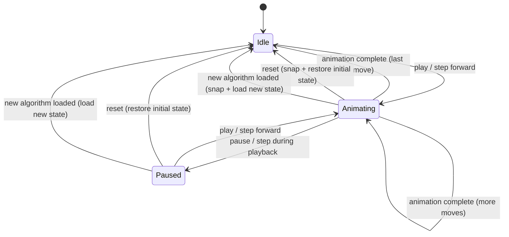

# 3D Rendering

This document describes the Three.js rendering layer for the 3D Rubik's cube visualization. All rendering code lives in `src/lib/three/`.

## Architecture Overview

The rendering layer is a set of plain TypeScript classes that manage a Three.js scene. They are **not** Svelte components — they are imperative objects instantiated inside `onMount` of the `CubeViewer.svelte` component.

```
CubeScene (owns the scene, camera, renderer)
├── CubeMesh (builds and manages the 26 cubies)
├── CubeAnimator (handles face-turn animations)
└── OrbitControls (user camera rotation)
```

## CubeScene

The main entry point for the 3D scene.

### Constructor

Takes an `HTMLCanvasElement` and sets up:
- `THREE.Scene` with a background color (read from DaisyUI CSS variables)
- `THREE.PerspectiveCamera` positioned at a 3/4 angle looking at the origin (e.g., position `(3, 3, 3)` looking at `(0, 0, 0)`)
- `THREE.WebGLRenderer` bound to the provided canvas, with antialiasing enabled
- Ambient light + directional light for clean, shadow-free illumination
- `OrbitControls` for user-controlled camera rotation

### Methods

- `resize(width: number, height: number)` — Updates camera aspect ratio and renderer size. Called by `ResizeObserver`.
- `render()` — Called on each `requestAnimationFrame`. Updates controls, renders the scene.
- `dispose()` — Cleans up all Three.js resources. Called on `onDestroy`.
- `setBackgroundColor(color: string)` — Updates the scene background to match the current theme.

## CubeMesh

Builds the visual representation of the Rubik's cube.

### Construction

A 3x3x3 grid of cubies, 26 in total (the invisible center cube is omitted). Each cubie is a `THREE.Group` containing:

1. **Body**: A slightly rounded `BoxGeometry` with black material (the plastic body of the cubie)
2. **Stickers**: Colored `PlaneGeometry` faces offset slightly outward from the body. Only the externally visible faces have stickers (a corner has 3, an edge has 2, a center has 1).

### Cubie Positions

Cubies are placed at integer coordinates from -1 to 1:
- Corner at `(1, 1, 1)` = URF corner (Up-Right-Front)
- Edge at `(0, 1, 1)` = UF edge (Up-Front)
- Center at `(0, 1, 0)` = U center (Up)

### Color Mapping

The `updateColors(state: number[54])` method maps the 54-element state array to sticker materials:
- Each sticker mesh knows its position on the cube (which face, which index)
- The method reads the color value from the state array and sets the material color accordingly

### Face Grouping

`getFaceCubies(face: Face): THREE.Object3D[]` returns the 9 cubies on a given face. Used by the animator to group cubies for rotation. A cubie "belongs to" a face based on its position:
- U face: all cubies with `y === 1`
- R face: all cubies with `x === 1`
- F face: all cubies with `z === 1`
- etc.

## CubeAnimator

Handles smooth face-turn animations.

### Animation Strategy

When a move is requested:

1. **Identify cubies**: Use `getFaceCubies()` to get the 9 cubies on the turning face.
2. **Create turn group**: Create a temporary `THREE.Group` at the origin. Reparent the 9 cubies into this group.
3. **Tween rotation**: Animate the group's rotation around the appropriate axis. "Clockwise" is always defined as **looking at the face from the outside of the cube** (the standard Rubik's cube convention):

   | Face | Axis | Clockwise direction (looking at face) | Angle sign |
   |------|------|---------------------------------------|------------|
   | U | Y | Looking down at the top → CW | -90° (negative Y rotation) |
   | D | Y | Looking up at the bottom → CW | +90° (positive Y rotation) |
   | R | X | Looking at the right side → CW | -90° (negative X rotation) |
   | L | X | Looking at the left side → CW | +90° (positive X rotation) |
   | F | Z | Looking at the front → CW | -90° (negative Z rotation) |
   | B | Z | Looking at the back → CW | +90° (positive Z rotation) |

   Counter-clockwise (prime moves) reverse the sign. Double moves use ±180° (sign doesn't matter for 180°).
4. **Complete**: When the animation finishes (~300ms):
   - Reparent cubies back to the scene root
   - **Reset all cubie transforms** to their canonical grid positions
   - Call `updateColors()` with the new logical state

#### Scene Graph Reparenting (Visual)

The reparenting strategy during animation, shown as three scene graph snapshots:

```
BEFORE (idle)              DURING (animating R)         AFTER (complete)

Scene                      Scene                        Scene
├── cubie(1,1,1)           ├── cubie(1,1,-1)            ├── cubie(1,1,1)   ← reset
├── cubie(1,1,0)           ├── cubie(1,-1,-1)           ├── cubie(1,1,0)     transforms
├── cubie(1,1,-1)          ├── ...                      ├── cubie(1,1,-1)    + recolor
├── cubie(1,0,1)           ├── (17 other cubies)        ├── cubie(1,0,1)
├── cubie(1,0,0)           │                            ├── cubie(1,0,0)
├── cubie(1,0,-1)          └── TurnGroup (temp)         ├── cubie(1,0,-1)
├── cubie(1,-1,1)              │ rotation: -90° X       ├── cubie(1,-1,1)
├── cubie(1,-1,0)              ├── cubie(1,1,1)         ├── cubie(1,-1,0)
├── cubie(1,-1,-1)             ├── cubie(1,1,0)         ├── cubie(1,-1,-1)
├── ... (17 others)            ├── cubie(1,1,-1)        ├── ... (17 others)
                               ├── cubie(1,0,1)
                               ├── cubie(1,0,0)
                               ├── cubie(1,0,-1)
                               ├── cubie(1,-1,1)
                               ├── cubie(1,-1,0)
                               └── cubie(1,-1,-1)
```

The 9 cubies with `x === 1` are reparented into a temporary `TurnGroup`. The group rotates around the X axis. On completion, cubies return to the scene root with canonical transforms, and colors are updated from the logical state.

### Drift Prevention (Critical)

**Never accumulate cubie rotations across multiple moves.**

After each animation completes, every cubie's position and rotation are reset to their canonical values (integer positions, identity rotation). The visual state is then reconstructed purely from the logical `number[54]` state array via `updateColors()`.

This prevents floating-point drift that would cause cubies to gradually misalign after many moves. The logical state is always the source of truth.

### Animation Timing

- Duration: ~300ms per move (adjustable for speed control)
- Easing: Ease-in-out for natural feel
- Implementation: Simple lerp in `requestAnimationFrame`, no external tween library needed

### Sequential Animation

To play a full algorithm:

```typescript
async function playAlgorithm(moves: Move[]): Promise<void> {
  for (const move of moves) {
    if (isPaused) break;
    await animator.animate(move);
  }
}
```

A pause flag is checked between moves. Step-forward/step-back advance one move at a time.

### Animation Interruption

If the user triggers a new action while an animation is in progress (e.g., loading a new algorithm, clicking step-forward rapidly, or pressing reset mid-playback):

1. **New algorithm loaded**: Cancel the current animation immediately. Snap the in-progress move to its final state (apply the remaining rotation instantly, then reset transforms and update colors). Then load the new algorithm's initial state.

2. **Step during playback**: Pause auto-playback. If a move is mid-animation, let it finish (do not cancel), then do not advance to the next move automatically.

3. **Reset during playback**: Cancel the current animation. Snap cubies to canonical positions. Restore the initial unsolved state. Clear playback history.

4. **Rapid step-forward clicks**: Queue the next step. If an animation is already running, wait for it to complete before starting the next. Do not skip animations — each move should be visually shown, even if briefly.

The key invariant: **the logical cube state and the visual state must always agree after any animation completes or is cancelled**. If an animation is cancelled mid-tween, snap the logical state forward (apply the move) and reset cubie transforms to match.

### Animation State Machine



Transitions labeled with the user action. "Snap" means the in-progress animation is completed instantly (rotation applied, transforms reset, colors updated) before the state change takes effect.

## OrbitControls

Wraps `THREE.OrbitControls` with these settings:
- **Damping**: Enabled for smooth deceleration after dragging
- **Auto-rotate**: Disabled by default (could be enabled on the home page for visual appeal)
- **Zoom limits**: Min/max distance set so the cube stays a reasonable size on screen
- **Pan**: Disabled (the cube should stay centered)

## Canvas Integration

### Mounting

`CubeViewer.svelte` creates a `<canvas>` element and passes it to `CubeScene` in `onMount`:

```svelte
<script>
  let canvas: HTMLCanvasElement;
  let scene: CubeScene;

  onMount(() => {
    scene = new CubeScene(canvas);
    return () => scene.dispose();
  });
</script>

<canvas bind:this={canvas}></canvas>
```

### Resizing

A `ResizeObserver` watches the canvas container and calls `scene.resize()` on size changes. This is more reliable than `window.resize` events, especially in flex/grid layouts.

### Theme-Aware Background

When the theme changes (dark ↔ light), read the DaisyUI `--b1` (base background) CSS variable from the DOM and pass it to `scene.setBackgroundColor()`. This keeps the 3D canvas background consistent with the page theme.

## Performance

The cube is lightweight for Three.js:
- 26 cubies × ~4 faces each = ~104 meshes
- Well under 200 draw calls — no optimization needed
- `requestAnimationFrame` loop should stop rendering when the tab is not visible (check `document.hidden`)
