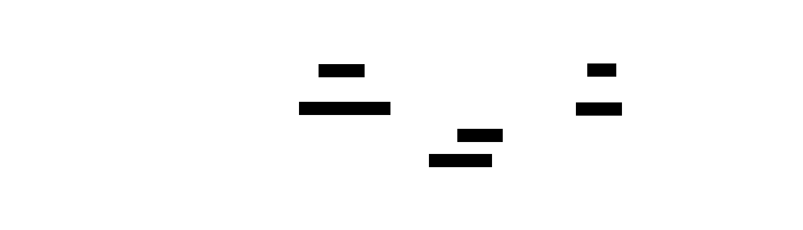

# 3D Rendering

This document describes the Three.js rendering layer for the 3D Rubik's cube visualization. All rendering code lives in `src/lib/three/`.

## Architecture Overview

The rendering layer is a set of plain TypeScript classes that manage a Three.js scene. They are **not** Svelte components — they are imperative objects instantiated inside `onMount` of the `CubeViewer.svelte` component.

```
CubeScene (owns the scene, camera, renderer)
├── CubeMesh (builds and manages the 26 cubies)
├── CubeAnimator (handles face-turn animations)
└── OrbitControls (user camera rotation)
```

## CubeScene

The main entry point for the 3D scene.

### Constructor

Takes an `HTMLCanvasElement` and sets up:

- `THREE.Scene` with a background color (read from DaisyUI CSS variables)
- `THREE.PerspectiveCamera` positioned at `(3.5, 3.0, 3.5)` looking at the origin — a 3/4 angle that biases slightly toward the U face for OLL readability
- `THREE.WebGLRenderer` bound to the provided canvas, with antialiasing enabled
- Ambient light + two directional lights (key + fill) for clean, shadow-free illumination that keeps all faces readable from any orbit angle
- `OrbitControls` for user-controlled camera rotation

### Methods

- `resize(width: number, height: number)` — Updates camera aspect ratio and renderer size. Called by `ResizeObserver`.
- `render()` — Called on each `requestAnimationFrame`. Updates controls, renders the scene.
- `dispose()` — Cleans up all Three.js resources. Called on `onDestroy`.
- `setBackgroundColor(color: string)` — Sets the scene background to an arbitrary CSS color string.
- `syncBackground()` — Re-resolves the DaisyUI `bg-base-100` color via canvas pixel sampling and updates the scene background. Called by `CubeViewer` on mount and on theme change.

## CubeMesh

Builds the visual representation of the Rubik's cube.

### Construction

A 3x3x3 grid of cubies, 26 in total (the invisible center cube is omitted). Each cubie is a `THREE.Group` containing:

1. **Body**: A slightly rounded `BoxGeometry` with black material (the plastic body of the cubie)
2. **Stickers**: Colored `PlaneGeometry` faces offset slightly outward from the body. Only the externally visible faces have stickers (a corner has 3, an edge has 2, a center has 1).

### Cubie Positions

Cubies are placed at integer coordinates from -1 to 1:

- Corner at `(1, 1, 1)` = URF corner (Up-Right-Front)
- Edge at `(0, 1, 1)` = UF edge (Up-Front)
- Center at `(0, 1, 0)` = U center (Up)

### Color Mapping

The `updateColors(state: number[54])` method maps the 54-element state array to sticker materials:

- Each sticker mesh knows its position on the cube (which face, which index)
- The method reads the color value from the state array and sets the material color accordingly

### Face Grouping

`getFaceCubies(face: Face): THREE.Object3D[]` returns the 9 cubies on a given face. Used by the animator to group cubies for rotation. A cubie "belongs to" a face based on its position:

- U face: all cubies with `y === 1`
- R face: all cubies with `x === 1`
- F face: all cubies with `z === 1`
- etc.

## CubeAnimator

Handles smooth face-turn animations.

### Animation Strategy

When a move is requested:

1. **Identify cubies**: Use `getFaceCubies()` to get the 9 cubies on the turning face.
2. **Create turn group**: Create a temporary `THREE.Group` at the origin. Reparent the 9 cubies into this group.
3. **Tween rotation**: Animate the group's rotation around the appropriate axis. "Clockwise" is always defined as **looking at the face from the outside of the cube** (the standard Rubik's cube convention):

   | Face | Axis | Clockwise direction (looking at face) | Angle sign                 |
   | ---- | ---- | ------------------------------------- | -------------------------- |
   | U    | Y    | Looking down at the top → CW          | -90° (negative Y rotation) |
   | D    | Y    | Looking up at the bottom → CW         | +90° (positive Y rotation) |
   | R    | X    | Looking at the right side → CW        | -90° (negative X rotation) |
   | L    | X    | Looking at the left side → CW         | +90° (positive X rotation) |
   | F    | Z    | Looking at the front → CW             | -90° (negative Z rotation) |
   | B    | Z    | Looking at the back → CW              | +90° (positive Z rotation) |

   Counter-clockwise (prime moves) reverse the sign. Double moves use ±180° (sign doesn't matter for 180°).

4. **Complete**: When the animation finishes (250ms at default speed):
   - Reparent cubies back to the scene root
   - **Reset all cubie transforms** to their canonical grid positions
   - Call `updateColors()` with the new logical state

#### Scene Graph Reparenting (Visual)

The reparenting strategy during animation, shown as three scene graph snapshots:

```
BEFORE (idle)              DURING (animating R)         AFTER (complete)

Scene                      Scene                        Scene
├── cubie(1,1,1)           ├── cubie(1,1,-1)            ├── cubie(1,1,1)   ← reset
├── cubie(1,1,0)           ├── cubie(1,-1,-1)           ├── cubie(1,1,0)     transforms
├── cubie(1,1,-1)          ├── ...                      ├── cubie(1,1,-1)    + recolor
├── cubie(1,0,1)           ├── (17 other cubies)        ├── cubie(1,0,1)
├── cubie(1,0,0)           │                            ├── cubie(1,0,0)
├── cubie(1,0,-1)          └── TurnGroup (temp)         ├── cubie(1,0,-1)
├── cubie(1,-1,1)              │ rotation: -90° X       ├── cubie(1,-1,1)
├── cubie(1,-1,0)              ├── cubie(1,1,1)         ├── cubie(1,-1,0)
├── cubie(1,-1,-1)             ├── cubie(1,1,0)         ├── cubie(1,-1,-1)
├── ... (17 others)            ├── cubie(1,1,-1)        ├── ... (17 others)
                               ├── cubie(1,0,1)
                               ├── cubie(1,0,0)
                               ├── cubie(1,0,-1)
                               ├── cubie(1,-1,1)
                               ├── cubie(1,-1,0)
                               └── cubie(1,-1,-1)
```

The 9 cubies with `x === 1` are reparented into a temporary `TurnGroup`. The group rotates around the X axis. On completion, cubies return to the scene root with canonical transforms, and colors are updated from the logical state.

### Drift Prevention (Critical)

**Never accumulate cubie rotations across multiple moves.**

After each animation completes, every cubie's position and rotation are reset to their canonical values (integer positions, identity rotation). The visual state is then reconstructed purely from the logical `number[54]` state array via `updateColors()`.

This prevents floating-point drift that would cause cubies to gradually misalign after many moves. The logical state is always the source of truth.

### Animation Timing

Speed levels (from `ANIMATION_DURATION` in `CubeAnimator.ts`):

| Speed | Duration | Use |
|-------|----------|-----|
| `default` | 250ms | Normal playback |
| `fast` | 120ms | Experienced users scanning algorithms |
| `slow` | 500ms | Beginners studying individual moves |

Easing: Ease-in-out cubic. No external tween library — the easing function is a 5-line inline implementation.

Inter-move delay: 0ms. The ease-in-out curve creates a natural pause at the start/end of each move.

### Sequential Animation

`CubeAnimator.animate(move, targetState?)` is a one-shot imperative call that returns a `Promise<void>`. It animates a single move and resolves when the animation is complete.

Playback sequencing is owned by `cubeStore`, which runs an async loop: for each move, it calls `animator.animate(move, [...cubeState])` and awaits completion before advancing to the next move. This ensures animations never overlap regardless of playback speed.

The `AnimationState` (`'idle' | 'animating' | 'paused'`) in the animator is an internal concept used to prevent concurrent animations; the store's `isPlaying` / `playbackStatus` are the UI-visible state.

### Single Source of Truth: targetState Pattern

`CubeAnimator` keeps its own internal `logicalState` for cases where the animator drives the queue internally (e.g., the `play()` / `step()` methods on the animator itself). However, `cubeStore` is the canonical source of truth for logical cube state and always passes `targetState` when calling `animate()`.

The `animate(move, targetState)` signature accepts an optional authoritative post-move state from the store. When provided:

1. The animator uses `targetState` for re-coloring in `finishAnimation` instead of computing it internally via `applyMove`.
2. `this.logicalState` is set to `targetState` at animation start, keeping the animator's internal state in sync.

This eliminates the **dual-state problem**: before this pattern, both `cubeStore` and `CubeAnimator` independently applied moves to their own copies of the state. On mount, the animator was initialized with `solved()` while the store may have already loaded an algorithm — leading to diverged states and sticker colors being reset after each animation.

The rule: **`cubeStore` owns the logical state. `CubeAnimator.logicalState` is a follower, not an independent source.**

### Animation Interruption

If the user triggers a new action while an animation is in progress (e.g., loading a new algorithm, clicking step-forward rapidly, or pressing reset mid-playback):

1. **New algorithm loaded**: Cancel the current animation immediately. Snap the in-progress move to its final state (apply the remaining rotation instantly, then reset transforms and update colors). Then load the new algorithm's initial state.

2. **Step during playback**: Pause auto-playback. If a move is mid-animation, let it finish (do not cancel), then do not advance to the next move automatically.

3. **Reset during playback**: Cancel the current animation. Snap cubies to canonical positions. Restore the initial unsolved state. Clear playback history.

4. **Rapid step-forward clicks**: Queue the next step. If an animation is already running, wait for it to complete before starting the next. Do not skip animations — each move should be visually shown, even if briefly.

The key invariant: **the logical cube state and the visual state must always agree after any animation completes or is cancelled**. If an animation is cancelled mid-tween, snap the logical state forward (apply the move) and reset cubie transforms to match.

#### Implementation note: TurnGroup tagging

`cancelAndSnap()` in `CubeAnimator` locates in-flight TurnGroups by scanning the scene for objects with `userData['isTurnGroup'] === true`. The `animateMove()` method sets this flag on every TurnGroup it creates:

```typescript
const turnGroup = new THREE.Group();
turnGroup.userData['isTurnGroup'] = true; // required for cancelAndSnap detection
this.scene.add(turnGroup);
```

Without this flag, `cancelAndSnap` cannot find or clean up TurnGroups and cancellation will silently fail (cubies left orphaned inside the unremoved group). This flag is set correctly in the current implementation.

### Animation State Machine



> Source: `diagrams/animation-state-machine.d2`

**States:** Idle, Animating, Paused

**Transitions:**

- `[start]` --> Idle
- Idle --> Animating: play / step
- Animating --> Idle: last move done
- Animating --> Animating: move done, more queued
- Animating --> Paused: pause
- Animating --> Idle: reset
- Animating --> Idle: new algorithm
- Paused --> Animating: play / step
- Paused --> Idle: reset
- Paused --> Idle: new algorithm

When transitioning out of Animating via reset or new algorithm, the in-progress animation is snapped to completion (rotation applied instantly, transforms reset, colors updated) before the state change takes effect.

## OrbitControls

Wraps `THREE.OrbitControls` (`src/lib/three/controls.ts`) with these settings:

- **Damping**: Enabled, factor `0.08` (smooth but not floaty)
- **Auto-rotate**: Disabled by default (could be enabled on the home page hero as a future enhancement)
- **Zoom limits**: Min distance `4.0`, max distance `12.0`
- **Pan**: Disabled — the cube stays centered
- **Zoom**: Enabled (scroll wheel / pinch)

## Canvas Integration

### Mounting

`CubeViewer.svelte` creates a `<canvas>` element and passes it to `CubeScene` in `onMount`. The Three.js modules are imported dynamically inside `onMount` (never at the top level) to ensure SSR safety:

```svelte
<script>
  let canvas: HTMLCanvasElement;
  let scene: CubeScene | null = null;

  onMount(() => {
    (async () => {
      const [{ CubeScene, CubeMesh, CubeAnimator }, { solved }] = await Promise.all([
        import('$lib/three/index.js'),
        import('$lib/cube/index.js'),
      ]);
      const cubeScene = new CubeScene(canvas);
      const cubeMesh = new CubeMesh(cubeScene.getScene());
      const cubeAnim = new CubeAnimator(cubeScene, cubeMesh, solved());
      scene = cubeScene;
      cubeStore.setAnimator(cubeAnim);
    })();

    return () => {
      cubeStore.clearAnimator();
      scene?.dispose();
    };
  });
</script>

<canvas bind:this={canvas}></canvas>
```

### Resizing

A `ResizeObserver` watches the canvas container and calls `scene.resize()` on size changes. This is more reliable than `window.resize` events, especially in flex/grid layouts.

### Theme-Aware Background

When the theme changes (dark ↔ light), `CubeViewer` syncs the scene background via a `$effect` that reads `themeStore.theme`. It resolves the DaisyUI base color by appending a throwaway `div.bg-base-100` element to the DOM and reading `getComputedStyle(el).backgroundColor`, which returns a browser-resolved `rgb(...)` string. This is passed directly to `scene.setBackgroundColor()`.

Do not pass the raw `--b1` CSS variable value directly to `THREE.Color` — DaisyUI 5 stores oklch channel values without the `oklch()` wrapper, which `THREE.Color` cannot parse. See `theme-integration.md` for the full color resolution strategy.

## Design Artifacts

The Phase 3 rendering parameter decisions (camera position, lighting setup, orbit controls settings, animation timing, and color palette) are documented in [`designs/phase3-rendering-parameters.md`](../../designs/phase3-rendering-parameters.md). This spec was authored as a text document; there are no associated Figma frames for Phase 3.

## Performance

The cube is lightweight for Three.js:

- 26 cubies × ~4 faces each = ~104 meshes
- Well under 200 draw calls — no optimization needed
- `requestAnimationFrame` loop should stop rendering when the tab is not visible (check `document.hidden`)
